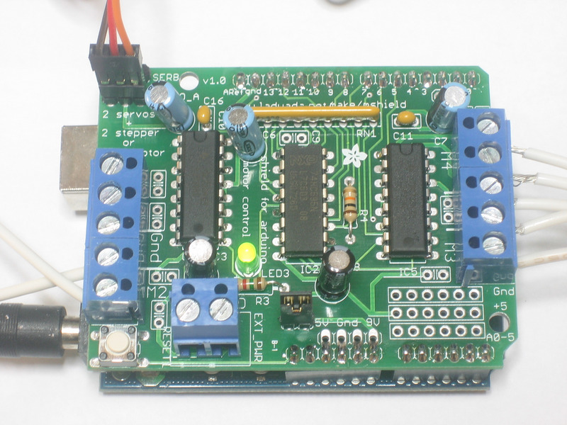
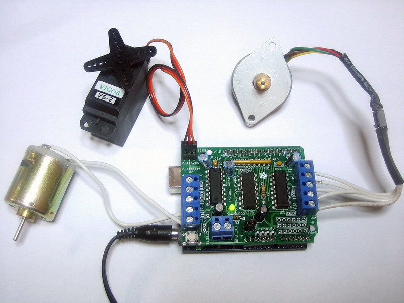
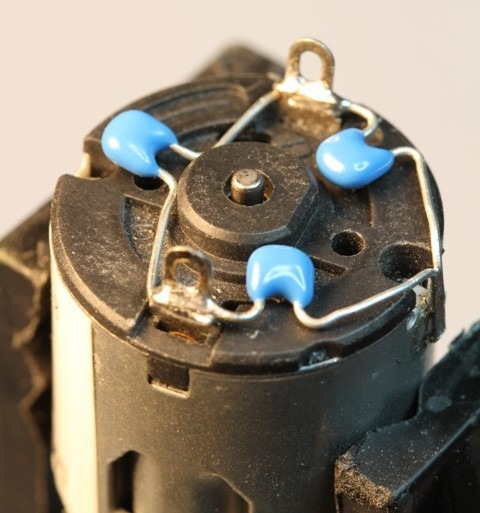
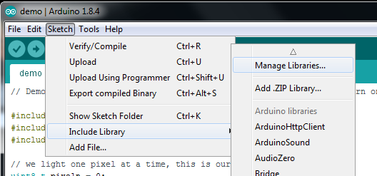
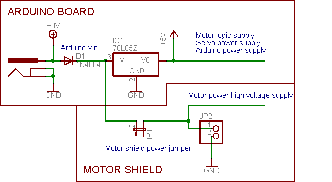
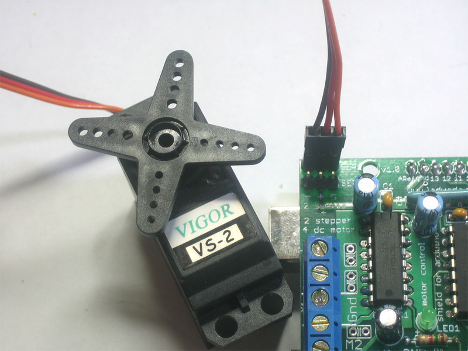
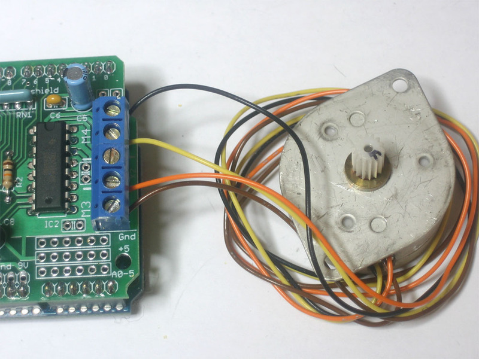
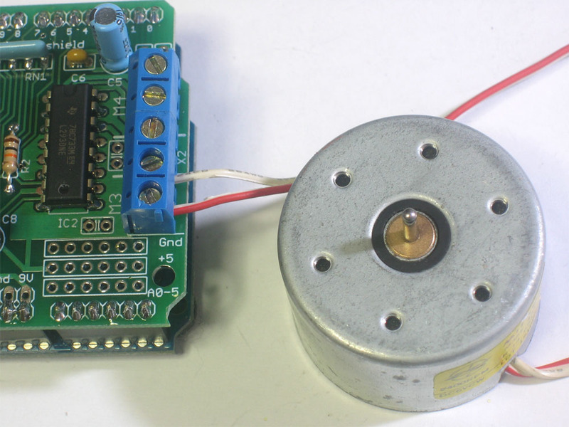
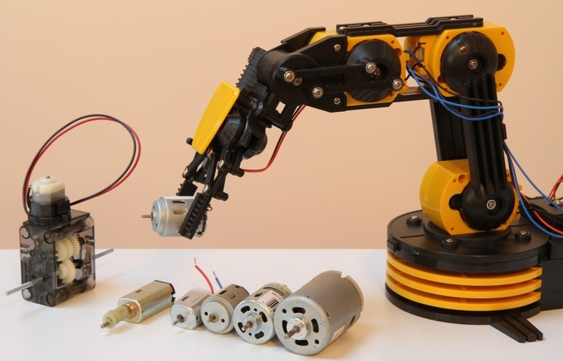

Traducció de Adafruit Motor Shield Created by lady ada
<https://learn.adafruit.com/adafruit-motor-shield>



# Visió general

Arduino és un gran punt de partida per a l’electrònica, i amb un
controlador de motors també pot ser una bona plataforma ordenada per a
la robòtica i la mecatrònica. Ací hi ha un disseny per a un controlador
de motors amb totes les funcions que li permetrà crear molts projectes
de complexitat simple a mitjana.

  - 2 connexions per a servos de 5V connectats al PWM dedicat d’alta
    resolució d’Arduino - sense fluctuacions\!

  - Fins a 4 motors de CC bidireccionals amb selecció de velocitat
    individual de 8 bits (per tant, aproximadament 0,5% de resolució)

  - Fins a 2 motors pas a pas (unipolars o bipolars) amb bobina simple,
    bobina doble, intercalats o micropassos.

  - 4 ponts H: el conjunt de xips L293D proporciona 0,6A Per pont (pic
    de 1,2 A) amb protecció de desconexió tèrmica, 4,5 V a 25 V

  - Les resistències "pull down" mantenen els motors desactivats durant
    l’arranc

  - Grans connectors de bloc de terminals per a connectar fàcilment
    cables (10-22 AWG) i alimentació

  - El botó de reinici d’Arduino apareix en la part superior

  - Bloc de terminals de 2 pins per a connectar alimentació externa, per
    a separar subministraments de lògica/motor

  - Provat compatible amb Mega, Diecimila i Duemilanove

  - [Kit complet disponible per a comprar a la botiga
    d’Adafruit](http://adafruit.com/products/81).

  - [Descarregue les biblioteques de programari Arduino fàcils d’usar i
    estarà llest per a
    començar\!](http://learn.adafruit.com/adafruit-motor-shield/downloads)



# FAQ

❓ **Quants motors puc usar amb aquest escut?**

Pot usar 2 servos de CC que funcionen amb 5 V i fins a 4 motors de CC o
2 motors pas a pas (o 1 pas a pas i fins a 2 motors de CC)

❓ **Puc connectar més motors?**

No, en aquest moment no és possible apilar l’escut o connectar-lo
fàcilment per a controlar 4 motors de passos, per exemple.

❓ **AJUDA\! El meu motor no funciona\! - AJUDA\! El meu motor no
funciona\!…​ Però els servos funcionen BÉ\!**

Està encés el LED? Les connexions del motor pas a pas i de CC no faran
res si el LED no està encés

No es moleste a escriure el codi de càrrega o connectar els motors si el
LED no s’encén, no funcionarà.

❓ **Per a què serveix el LED?**

El LED indica que la font d’alimentació del motor pas a pas/CC està
funcionant. Si no està encés, els motors de CC/pas a pas no funcionaran.
Els ports de servo tenen alimentació de 5 V i no utilitzen el
subministrament del motor de CC.

❓ **Estic tractant de construir aquest robot i no sembla funcionar amb
una bateria de 9V…​.**

Llija el [manual de
l’usuari](http://learn.adafruit.com/adafruit-motor-shield/use-it) per
a obtindre informació sobre les fonts d’alimentació adequades.

❓ **Pot aquest escut controlar xicotets motors de 3V?**

En realitat no, està dissenyat per a motors més grans de 6V+. No
funciona per a motors de 3V llevat que els sobrecarregue a 6V i després
es cremaran més ràpid

❓ **Per a què serveix el connector d’alimentació del controlador? Com
alimente els meus motors?**

Llija el [manual de
l’usuari](http://learn.adafruit.com/adafruit-motor-shield/use-it) per
a obtindre informació sobre les fonts d’alimentació adequades.

❓ **El meu Arduino s’inicia quan els motors estan funcionant\! Està
trencat l’escut?**

Els motors consumeixen molta energia i poden causar "caigudes de tensió"
que restableixen l’Arduino. Per aqueixa raó, el controlador està
dissenyat per a subministraments separats (dividits), un per a
l’electrònica i un altre per al motor. Fer això evitarà caigudes de
tensió. Llija el [manual de
l’usuari](http://learn.adafruit.com/adafruit-motor-shield/use-it) per
a obtindre informació sobre les fonts d’alimentació adequades.

❓ **Tinc bones fonts d’alimentació sòlides, però els motors de CC
semblen 'tallar-se' o 'saltar'.**

Intente soldar un condensador de ceràmica o de disc de 0.1uF entre les
pestanyes del motor (en el motor mateix\!) Això reduirà el soroll que
podria estar retroalimentant al circuit ([gràcies
macegr\!](http://forums.adafruit.com/viewtopic.php?f=31&t=10290))

❓ **Què succeeix si necessite més de 600mA per motor?**

[Pot substituir l’SN754410 (sota la seua responsabilitat) o soldar
alguns controladors L293D més damunt dels
existents.](http://learn.adafruit.com/adafruit-motor-shield/use-it)

❓ **Quins pins no s’utilitzen en l’escut del motor?**

Els 6 pins d’entrada analògica estan disponibles. També es poden usar
com a pins digitals (pins del núm. 14 al 19)

Els pins digitals 2 i 13 no s’utilitzen.

Els següents pins estan en ús sol si el CC/pas a pas indicat està en ús:

  - Pin digital 11: Motor CC núm. 1 / Pas a pas núm. 1
    (activació/control de velocitat)

  - Pin digital 3: Motor CC núm. 2 / Pas a pas núm. 1 (activació/control
    de velocitat)

  - Pin digital 5: Motor CC núm. 3 / Pas a pas núm. 2 (activació/control
    de velocitat)

  - Pin digital 6: Motor CC núm. 4 / Pas a pas núm. 2 (activació/control
    de velocitat)

Els següents pins estan en ús si s’usen DC/steppers

  - Els pins digitals 4, 7, 8 i 12 s’utilitzen per a impulsar els motors
    de CC/pas a pas a través del pestell de sèrie a paral·lel del
    74HC595

Els següents pins s’usen només si aqueix servo en particular està en ús:

  - Pin digital 9: control del servo núm. 1

  - Pin digital 10: control del servo núm. 2

❓ **Quins pins estan connectats als motors de CC/pas a pas?**

Els motors de CC/pas a pas NO estan connectats directament a l’Arduino.
Estan connectats al integrat 74HC595 al qual es comunica l’Arduino. NO
POT parlar directament amb els motors, HA D’usar la biblioteca de
protecció del motor.

❓ **Eh? No entenc…​**

[Pots intentar llegir aquest agradable resum escrit per Michael
K.](http://docs.google.com/View?docid=dgwf6cmm_2fznx7qgr)

❓ **Com puc connectar-me als pins no utilitzats?**

Els pins analògics (analògics 0-5, també coneguts com a pins digitals
14-19) es desglossen a la cantonada inferior dreta.

El pin 2 té una conexió habilitada ja que és l’únic pin veritablement
sense usar

Els pins restants no es trenquen perquè podrien ser utilitzats per
l’escut del motor. Si està segur que no està usant aqueixos pins, pot
connectar-los usant encapçalats d’apilament en assemblar el kit o
soldant en la part superior de l’encapçalat amb cables, o usant un "Wing
shield".

❓ **Rebo el següent error en intentar executar el codi d’exemple:
"error: AFMotor.h: No such file or directory…​"**

Assegure’s d’haver instal·lat la biblioteca AFMotor

❓ **Com instal·le la biblioteca?**

[Llija el nostre tutorial sobre
biblioteques](http://learn.adafruit.com/arduino-tips-tricks-and-techniques/arduino-libraries)

❓ Tinc dos motors pas a pas i vull fer-los funcionar simultàniament,
però el codi d’exemple només pot controlar un i després l’altre.

La rutina step() de la biblioteca de motors pas a pas no té la capacitat
de fer funcionar tots dos motors alhora. En el seu lloc, haurà de
'intercalar' les crides. Per exemple, perquè tots dos motors avancen 100
vegades, ha d’escriure un codi com aquest:

``` Arduino
for (i=0; i<100; i++) {
motor1.step(1, FORWARD, SIMGLE);
motor2.step(1, FORWARD, SIMGLE);
}
```

Si desitja un control més intel·ligent, consulte la biblioteca
AccelStepper (en la secció Descàrregues) que té alguns exemples de
control de motors pas a pas simultanis

❓ **Quins són alguns 'motors suggerits'?**

La majoria de la gent compra motors en botigues d’excedents i no tots
els motors seràn adequats.

No obstant això, atés que és una pregunta popular, suggerisc comprar
motors de Pololu (Servos de CC, motors de CC) o Jameco (de tota mena\!)
A més de les moltes botigues web excedents.

❓ **El motor shield és compatible amb UN R3 o Mega R3? Què passa amb els
pins addicionals?**

El controlador és compatible amb el UNO R3 i MEGA. Els R3 tenen 2 pins
addicionals en cada encapçalat. Aquests són duplicats d’altres pins en
l’encapçalat i no són necessaris per al controlador.

❓ **Estic usant una plataforma de robot 4WD i no puc fer que res
funcione.**

Els motors utilitzats en les plataformes robòtiques 4WD de Maker Shed,
DF Robotics, Jameco i altres tenen molt "soroll de raspall". Això
retroalimenta el circuit Arduino i provoca un funcionament inestable.
Aquest problema es pot solucionar soldant 3 condensadors de supressió de
soroll al motor. 1 entre els terminals del motor, i un de cada terminal
a la carcassa del motor.



❓ **Però el meu motor ja té un condensador i segueix sense funcionar.**

Aquests motors generen molt soroll d’escombretes i, en general,
necessiten l’efecte complet de 3 capacitores per a una supressió
adequada.

❓ **Per què no simplement es dissenya condensadors en la placa?**

No serien efectius allí. El soroll ha de suprimir-se en la font o els
cables del motor actuaran com a antenes i el transmetran a la resta del
sistema.

# Instal·lació de la biblioqueca

## Primer instal·le la biblioteca Arduino

Abans que puga usar el controlador de motors, ha d’instal·lar la
biblioteca AF\_Motor Arduino; això li indicarà a l’Arduino com parlar
amb el controlador Adafruit, i no és opcional\!

Òbriga l’administrador de la biblioteca Arduino:



Busque la biblioteca Adafruit Motor i instal·le-la. Assegure’s que siga
la biblioteca per a l’escut del motor V1.


També tenim un excel·lent tutorial sobre la instal·lació de la
biblioteca Arduino en:
<http://learn.adafruit.com/adafruit-all-about-arduino-libraries-install-use>

# Alimentant el circuit

## Alimentació dels motors de CC, requisits de voltatge i corrent

Els motors necessiten molta energia, especialment els motors barats, ja
que són menys eficients. El primer important és esbrinar quin voltatge
usarà el motor. Si té sort, el seu motor va vindre amb alguna mena
d’especificacions. Alguns motors xicotets per a passatemps només estan
dissenyats per a funcionar a 1,5 V, però és igual de comú tindre motors
de 6-12 V. Els controladors de motor d’aquest protector estan dissenyats
per a funcionar de 4,5 V a 25 V.

<div class="note">

LA MAJORIA DELS MOTORS D'1.5-3V NO FUNCIONARAN

</div>

**Requisits de corrent:** el segon que ha d’esbrinar és quanta corrent
necessitarà el seu motor. Els xips de controlador de motor que venen amb
el kit estan dissenyats per a proporcionar fins a 600 mA per motor, amb
un corrent màxim de 1,2 A. Tinga en compte que una vegada que es
dirigisca cap a 1A, probablement voldrà col·locar un dissipador de calor
en el controlador del motor; en cas contrari, tindrà una falla tèrmica,
possiblement cremant el xip.

**Sobre l’ús del SN754410:** Algunes persones usen el xip controlador de
motor SN754410 perquè és compatible amb pins, té díodes d’eixida i pot
proporcionar 1A per motor, 2A pic. Després d’una lectura acurada de la
fulla de dades i la discussió amb el suport tècnic de TI i els enginyers
d’energia, sembla que els díodes d’eixida van ser dissenyats només per a
protecció ESD i que usar-los com a protecció contra retorns és un truc i
no es garanteix el rendiment. Per aqueixa raó, el kit no ve amb
l’SN754410 i en el seu lloc usa el L293D amb díodes integrats de
protecció contra retorns. Si està disposat a arriscar-se i necessita
corrent addicional, no dubte a comprar SN754410 i reemplaçar els xips
proporcionats.

**Necessites més potència?** Compre un altre joc de controladors L293D i
soldeu-los just damunt dels que estan en la placa (piggyback). Així,
duplica la capacitat actual\! Pot soldar 2 xips més en la part superior
però que probablement no obté molts beneficis

**No pot fer funcionar els motors amb una bateria de 9 V, així que ni
tan sols perda el seu temps/bateries\!** Utilitze una bateria gran de
plom àcid o NiMH. També es recomana encaridament que configure dues
fonts d’alimentació (subministrament dividit), una per a Arduino i una
altra per als motors. El 99% dels 'problemes estranys del motor' es
deuen al soroll en la línia d’alimentació per compartir fonts
d’alimentació i/o no tindre una font prou potent\!

## Com configurar Arduino + Shield per a alimentar motors

Els servos s’alimenten amb els mateixos 5V regulats que usa l’Arduino.
Això està bé per als xicotets servos d’hobby suggerits. Si vol una mica
més robust, talle el rastre que va a + en els connectors del servo i
connecte el seu propi subministrament de 5-6V.

Els motors de CC s’alimenten d’un 'subministrament d’alt voltatge' i NO
dels 5V regulats. No connecte la font d’alimentació del motor a la línia
de 5V. Aquesta és una molt, molt, molt mala idea llevat que estigues
segur que saps el que estàs fent\!

Hi ha dos llocs des d’on pot obtindre el 'subministrament d’alt
voltatge' del seu motor. Un és el connector de CC en la placa Arduino i
l’altre és el bloc de 2 terminals en el controlador que està etiquetat
com EXT\_PWR. El DC Jack en l’Arduino té un díode de protecció, per la
qual cosa no podrà desbaratar massa les coses si connecta el tipus
d’alimentació incorrecte. No obstant això, els terminals EXT\_PWR en
l’escut no tenen un díode de protecció (per una bona raó). Tingues
molta cura de no endollar-lo a l’inrevés o destruiràs el protector del
motor i/o el teu Arduino\!

Així és com funciona:



Si desitja tindre una sola font d’alimentació de CC per a l’Arduino i
els motors, simplement connecte-la al connector de CC de l’Arduino o al
bloc PWR\_EXT de 2 pins en l’escut. Col·loque el pont d’alimentació en
el protector del motor.

Si té un Arduino Diecimila, configure el pont de la font d’alimentació
d’Arduino en EXT. Tinga en compte que pot tindre problemes amb els
reinicis d’Arduino si el subministrament de la bateria no pot
proporcionar energia constant, i no és una forma suggerida d’alimentar
el seu projecte de motor.

Si desitja que l’Arduino s’alimente amb USB i els motors s’alimenten amb
una font d’alimentació de CC, connecte el cable USB. Després connecte el
subministrament del motor al bloc PWR\_EXT en l’escut. No col·loque el
pont en l’escut. Aquest és un mètode suggerit per a alimentar el seu
projecte de motor (Si té un Arduino Diecimila, no oblide configurar el
pont d’alimentació d’Arduino en USB. Si té un Diecimila, alternativament
pot fer el següent: connecte la font d’alimentació de CC a l’Arduino i
col·loque el pont en el motor escut.)

Si desitja tindre 2 fonts d’alimentació de CC separades per a Arduino i
motors. Endolle el subministrament per a l’Arduino en el connector de CC
i connecte el subministrament del motor al bloc PWR\_EXT. Assegure’s de
llevar el pont del protector del motor. Si té un Arduino Diecimila,
configure el pont Arduino en EXT. Aquest és un mètode suggerit per a
alimentar el seu projecte de motor

De qualsevol manera, si desitja utilitzar el motor de CC/pas a pas, el
LED del protector del motor ha d’estar encés per a indicar una bona
potència del motor.

# Ús de servos RC



Els servos són la forma més fàcil de començar amb el control del motor.
Tenen una connexió de capçal femella de 3 pins de 0,1" amb +5 V, terra i
entrada de senyal. El protector del motor simplement trau les línies
d’eixida PWM de 16 bits a dos capçals de 3 pins perquè siga fàcil
d’endollar i llest. Poden consumir molta energia, per la qual cosa una
bateria de 9V no durarà més d’uns minuts\!

El que té de bo usar el PWM integrat és que és molt precís i fa el seu
treball en segon pla. Pot usar la biblioteca Servo incorporada

[Usar els servos és fàcil, llija la documentació oficial d’Arduino per a
saber com usar-los i veja els esbossos de servos d’exemple en
l’IDE.](http://www.arduino.cc/en/Reference/Servo)

L’energia per als servos prové del regulador de 5 V integrat de
l’Arduino, alimentat directament des del connector d’alimentació USB o
CC de l’Arduino. Si necessita un subministrament extern, talle el rastre
just davall dels pins del servo (en les plaques v1.2) i connecte un
subministrament de CC de 5V o 6V directament. L’ús d’una font externa és
per a usuaris avançats, ja que pot destruir accidentalment els servos en
connectar una font d’alimentació incorrectament\!

<div class="warning">

Quan utilitze el capçal de subministrament extern per a servos, vaja amb
compte que la part inferior dels pins del capçal no entren en contacte
amb la carcassa metàl·lica del port USB de l’Arduino. Un tros de cinta
aïllant en la carcassa el protegirà contra curtcircuits.

</div>

# Ús de motors pas a pas



Els motors pas a pas són excel·lents per a un control (semi) precís,
perfectes per a molts projectes de robots i CNC. Aquest controlador de
motors admet fins a 2 motors pas a pas. La biblioteca funciona de manera
idèntica per a motors bipolars i unipolars.

Per a motors unipolars: per a connectar el pas a pas, primer esbrine
quins pins estan connectats a quina bobina i quins pins són les bornes
centrals. Si és un motor de 5 fils, llavors hi haurà 1 que és la clau
central per a totes dues bobines. [Hi ha molts tutorials en línia sobre
com realitzar enginyeria inversa en el pinout de les
bobines](http://learn.adafruit.com/adafruit-motor-shield/resources). Les
derivacions centrals han de connectar-se juntes al terminal GND en el
bloc d’eixida del controlador del motor. després, la bobina 1 ha de
connectar-se a un port del motor (per exemple, M1 o M3) i la bobina 2 ha
de connectar-se a l’altre port del motor (M2 o M4).

Per a motors bipolars: és igual que els motors unipolars excepte que no
hi ha un cinqué cable per a connectar a terra. El codi és exactament el
mateix.

Fer funcionar un motor pas a pas és una mica més complex que fer
funcionar un motor de CC, però continua sent molt fàcil

1.  Assegure’s de incloure **\#include \<AFMotor.h\>**

2.  Crea l’objecte de motor pas a pas amb **AF\_Stepper(steps,
    stepper\#)** per a configurar el pont H del motor i els pins.
    **steps** indica quants passos per revolució té el motor. un motor
    de 7,5 graus/pas té 360/7,5 = 48 passos. **stepper\#** és a quin
    port està connectat. Si està usant M1 i M2, és el port 1. Si està
    usant M3 i M4, és el port 2

3.  Establisca la velocitat del motor usant **setSpeed(rpm)**, on
    **rpm** és la quantitat de revolucions per minut que desitja que
    gire el motor pas a pas.

4.  Després, cada vegada que desitge que el motor es moga, cride al
    procediment **step(\#steps, direction, steptype)**. **\#steps** és
    la quantitat de passos que desitja que prenga. **direction** la
    direcció és FORWARD(avança) o BACKWARD(arrere) i **steptype** és
    SINGLE, DOUBLE. INTERLEAVE o MICROSTEP.  
    "Single" significa activació de bobina simple, "double" significa
    que s’activen 2 bobines alhora (per a un parell més alt) i
    "interleave" significa que alterna entre simple i doble per a
    obtindre el doble de resolució (però per descomptat és la meitat de
    la velocitat) . "Microstepping" és un mètode en el qual les bobines
    tenen PWM per a crear un moviment suau entre els passos. [Hi ha
    tones d’informació sobre els pros i els contres d’aquests diferents
    mètodes de pas en la pàgina de
    recursos.](http://learn.adafruit.com/adafruit-motor-shield/resources)  
    Pot usar el mètode de pas que desitge, canviant-lo "sobre la marxa"
    segons desitge, amb la mínima potència, més torque o més precisió.

5.  Per defecte, el motor 'mantindrà' la posició després d’haver acabat
    d’avançar. Si desitja alliberar totes les bobines, perquè puga girar
    lliurement, cride a **release()**

6.  Els comandos de passos estan 'bloquejant' i tornaran una vegada que
    els passos hagen acabat.

Pel fet que els comandos pas a pas es 'bloquegen', ha d’instruir als
motors pas a pas cada vegada que desitge que es moguen. Si desitja
tindre més d’un control pas a pas de 'tasca en segon pla', [consulte la
biblioteca AccelStepper](https://github.com/adafruit/AccelStepper)
(s’instal·la de manera similar a com ho va fer amb AFMotor) que té
alguns exemples per a controlar dos passos simultàniament amb
acceleració variable

``` Arduino
#include <AFMotor.h>


AF_Stepper motor(48, 2);


void setup() {
  Serial.begin(9600);           // set up Serial library at 9600 bps
  Serial.println("Stepper test!");

  motor.setSpeed(10);  // 10 rpm

  motor.step(100, FORWARD, SINGLE);
  motor.release();
  delay(1000);
}

void loop() {
  motor.step(100, FORWARD, SINGLE);
  motor.step(100, BACKWARD, SINGLE);

  motor.step(100, FORWARD, DOUBLE);
  motor.step(100, BACKWARD, DOUBLE);

  motor.step(100, FORWARD, INTERLEAVE);
  motor.step(100, BACKWARD, INTERLEAVE);

  motor.step(100, FORWARD, MICROSTEP);
  motor.step(100, BACKWARD, MICROSTEP);
}
```

# Ús de motors CC



## Els motors de CC s’utilitzen per a tota mena de projectes robòtics.

El controlador de motors pot impulsar fins a 4 motors de CC
bidireccionalment. Això significa que poden ser conduïts cap avant i cap
endarrere. La velocitat també es pot variar en increments de 0,5%
utilitzant el PWM incorporat d’alta qualitat. Això significa que la
velocitat és molt suau i no variarà\!

Tinga en compte que el xip del pont H no està dissenyat per a impulsar
càrregues de més de 0,6 A o aqueix pic de més de 1,2 A, per la qual
cosa això és per a motors xicotets. Consulte la fulla de dades per a
obtindre informació sobre el motor per a verificar que estiga bé.

Per a connectar un motor, simplement sueldeu dos cables als terminals i
després connecte’ls a M1, M2, M3 o M4. Després segueix aquests passos en
el teu esbós.

1.  Assegure’s de incloure **\#include \<AFMotor.h\>**

2.  Crea l’objecte AF\_DCMotor amb **AF\_DCMotor(motor\#, frequency)**
    per a configurar el pont H del motor i els pins. El constructor pren
    dos arguments.  
    El primer és a quin port està connectat el motor, 1, 2, 3 o 4.  
    *frequency* és la rapidesa de la senyal de control de velocitat.  
    Per als motors 1 i 2, pot triar MOTOR12\_64KHZ, MOTOR12\_8KHZ,
    MOTOR12\_2KHZ o MOTOR12\_1KHZ. Una velocitat alta com 64 KHZ no serà
    audible, però una velocitat baixa com 1 KHZ consumirà menys energia.
    Els motors 3 i 4 només poden funcionar a 1 KHZ i ignoraran qualsevol
    configuració donada.

3.  Després pot configurar la velocitat del motor usant **setSpeed
    ​​(speed)** on la velocitat varia de 0 (aturat) a 255 (velocitat
    màxima). Pots configurar la velocitat quan vulgues.

4.  Per a fer funcionar el motor, cride a **run(direction)** on la
    direcció és FORWARD(avana), BACKWARD(arrere) o RELEASE(alliberar).
    Per descomptat, l’Arduino en realitat no sap si el motor està 'cap
    avant' o 'cap endarrere', per la qual cosa si desitja canviar la
    forma en què pensa que està cap avant, simplement canvie els dos
    cables del motor al controlador.

<!-- end list -->

``` Arduino
#include <AFMotor.h>

AF_DCMotor motor(2, MOTOR12_64KHZ); // create motor #2, 64KHz pwm

void setup() {
  Serial.begin(9600);           // set up Serial library at 9600 bps
  Serial.println("Motor test!");

  motor.setSpeed(200);     // set the speed to 200/255
}

void loop() {
  Serial.print("tick");

  motor.run(FORWARD);      // turn it on going forward
  delay(1000);

  Serial.print("tock");
  motor.run(BACKWARD);     // the other way
  delay(1000);

  Serial.print("tack");
  motor.run(RELEASE);      // stopped
  delay(1000);
}
```

# La classe AF\_DCMotor



La classe AF\_DCMotor proporciona control de velocitat i direcció per a
fins a quatre motors de corrent continu quan s’utilitza amb l’Adafruit
Motor Shield. Per utilitzar-ho en un esbós, primer heu d’afegir la línia
següent al principi del vostre codi:

``` Arduino
#include <AFMotor.h>
```

## AF\_DCMotor motorname(portnum, freq)

Aquest és el constructor d’un motor de corrent continu. Cride a aquest
constructor una vegada per a cada motor en el seu esquema. Cada
instància de motor ha de tindre un nom diferent com en l’exemple a
continuació.

Paràmetres:

  - **portnum**: selecciona a quin canal (1-4) del controlador del motor
    es connectarà el motor

  - **freq**: selecciona la freqüència PWM. Si no s’especifica cap
    freqüència, s’utilitza 1 KHZ de manera predeterminada.
    
      - Les freqüències per als canals 1 i 2 són:
        
          - MOTOR12\_64KHZ
        
          - MOTOR12\_8KHZ
        
          - MOTOR12\_2KHZ
        
          - MOTOR12\_1KHZ
    
      - Les freqüències per als canals 3 i 4 són:
        
          - MOTOR34\_64KHZ
        
          - MOTOR34\_8KHZ
        
          - MOTOR34\_1KHZ

Exemple:

``` Arduino
AF_DCMotor motor4(4); // define motor on channel 4 with 1KHz default PWM
AF_DCMotor left_motor(1, MOTOR12_64KHZ);  // define motor on channel 1 with 64KHz PWM
```


*Nota: Les freqüències més altes produiran un brunzit menys audible
durant el funcionament, però poden resultar en un parell més baix amb
alguns motors.*

## setSpeed(speed)

Estableix la velocitat del motor.

Paràmetres:

  - **speed**: els valors vàlids per a 'speed' estan entre 0 i 255, sent
    0 desactivat i 255 com a màximes revolucions.

Exemple:

*Nota: La resposta del motor de CC no sol ser lineal, per la qual cosa
les RPM reals no seran necessàriament proporcionals a la velocitat
programada.*

## run(cmd)

Estableix la manera de funcionament del motor.

Paràmetres:

  - **cmd** - la manera de funcionament desitjat per al motor
    
      - Els valors vàlids per a cmd són:
        
          - **FORWARD**: marxa cap avant (la direcció real de rotació
            dependrà del cablejat del motor)
        
          - **BACKWARD**: corre cap endarrere (la rotació serà en la
            direcció oposada a CAP AVANT)
        
          - **RELEASE** - Detindre el motor. Això elimina l’alimentació
            del motor i és equivalent a setSpeed(0). El controlador no
            implementa el frenat dinàmic, per la qual cosa el motor pot
            tardar un temps a detindre’s.

Exemple:

``` Arduino
motor.run(FORWARD);
delay(1000);  // run forward for 1 second
motor.run(RELEASE);
delay(100);  // 'coast' for 1/10 second
motor.run(BACKWARDS);  // run in reverse
```

# AF\_Stepper Class


La classe AF\_Stepper proporciona control d’un o diversos passos per a
fins a 2 motors pas a pas quan s’usa amb Adafruit Motor Shield. Per a
usar això en un esbós, primer ha d’agregar la següent línia al
començament del seu esbós:

``` Arduino
#include <AFMotor.h>
```

## AF\_Stepper steppername(steps, portnumber)

El constructor AF\_Stepper defineix un motor pas a pas. Crida’l una
vegada per cada motor pas a pas en el seu esbós. Cada instància de motor
pas a pas ha de tindre un nom únic com en l’exemple a continuació.

Paràmetres:

  - **steps**: declare el nombre de passos per revolució per al seu
    motor.

  - **portnum**: declara com es connectarà el motor a l’escut.
    
      - Els valors vàlids per a 'portnum' són 1 (canals 1 i 2) i 2
        (canals 3 i 4).

Exemple:


``` Arduino
AF_Stepper Stepper1(48, 1);  // A 48-step-per-revolution motor on channels 1 & 2
AF_Stepper Stepper2(200, 2);   // A 200-step-per-revolution motor on channels 3 & 4
```

## step(steps, direction, style)

Mou el motor.

Paràmetres:

  - **steps** - el nombre de passos per a girar

  - **direction** - la direcció de rotació (FORWARD o BACKWARD)

  - **style** - l’estil de treball. Els valors vàlids per a 'estil' són:
    
      - SINGLE: s’activa una bobina alhora.
    
      - DOUBLE: s’energitzen dues bobines alhora per a obtindre més par.
    
      - INTERLEAVE: alterna entre simple i doble per a crear un mig pas.
        Això pot resultar en una operació més suau, però a causa del mig
        pas addicional, la velocitat també es redueix a la meitat.
    
      - MICROSTEP: les bobines adjacents augmenten i disminueixen per a
        crear una sèrie de "micropassos" entre cada pas complet. Això
        dona com a resultat una resolució més fina i una rotació més
        suau, però amb una pèrdua de parell.

<div class="note">

Step és un comando síncrono i no tornarà fins que s’hagen completat tots
els passos. Per al moviment simultani de dos motors, ha de manejar el
temps de pas per a tots dos motors i usar la funció "onestep()" a
continuació.

</div>

``` Arduino
Stepper1.step(100, FORWARD, DOUBLE); // 100 steps forward using double coil stepping
Stepper2.step(100, BACKWARD, MICROSTEP);   // 100 steps backward using double microstepping
```

## setSpeed(RPMspeed)

Establir la velocitat del motor

Paràmetres:

  - **RPMspeed** - la velocitat en RPM

<div class="note">

La velocitat de pas resultant es basa en el paràmetre 'steps' del
constructor. Si això no coincideix amb el nombre de passos del seu
motor, la seua velocitat real també estarà desactivada.

</div>

Exemple:

``` Arduino
Stepper1.setSpeed(10);  // Set motor 1 speed to 10 rpm
Stepper2.setSpeed(30);  // Set motor 2 speed to 30 rpm
```

## onestep(direction, stepstyle)

Un únic pas per al motor

Paràmetres:

  - **direction** - la direcció de rotació (FORWARD -CAP AVANT- o
    BACKWARD -CAP ENDARRERE-)

  - **stepstyle** - l’estil de pas. Els valors vàlids per a 'estil' són:
    
      - SINGLE: s’activa una bobina alhora.
    
      - INTERLEAVE: alterna entre simple i doble per a crear un mig pas.
        Això pot resultar en una operació més suau, però a causa del mig
        pas addicional, la velocitat també es redueix a la meitat.
    
      - MICROSTEP: les bobines adjacents augmenten i disminueixen per a
        crear una sèrie de "micropassos" entre cada pas complet. Això
        dona com a resultat una resolució més fina i una rotació més
        suau, però amb una pèrdua de parell.

Exemple:

``` Arduino
Stepper1.onestep(FORWARD, DOUBLE);  // take one step forward using double coil stepping
```

## release()

Allibera el parell de retenció en el motor. Això redueix la demanda de
corrent, però el motor no frenarà la rotació.

Exemple

``` Arduino
Stepper1.release(); // stop rotation and turn off holding torque.
```

# Recursos

# Idees i tutorials per a motors

  - [Wikipedia té tones d’informació sobre
    steppers](http://en.wikipedia.org/wiki/Stepper_motor)

  - [Tipus de motors pas a pas per
    Jones](http://www.cs.uiowa.edu/~jones/step/types.html)

  - [Enginyeria inversa dels pinouts dels cables pas a pas per
    Jason](http://www.jasonbabcock.com/computing/breadboard/unipolar/index.html)
