# Adafruit GFX Graphics Library

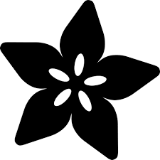

Traducció de Adafruit GFX Graphics Library Created by Phillip Burgess  
<https://learn.adafruit.com/adafruit-gfx-graphics-library>


## Visió general

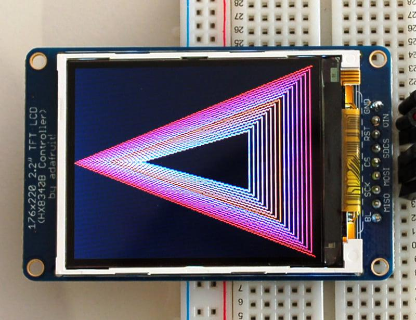

La biblioteca Adafruit_GFX per a Arduino proporciona una sintaxi comuna i un conjunt de gràfics funcions per a totes les pantalles LCD i OLED i matrius LED. Això permet l’Arduino esbossos que s’adaptaran fàcilment entre tipus de pantalla amb un fusible mínim …​ i qualsevol nou característiques, millores de rendiment i correccions d’errors s’aplicaran immediatament a tot el nostre ofrena completa de pantalles de color.

Adafruit_GFX sempre treballa juntament amb una biblioteca addicional única per a cada específic tipus de visualització. Aquests es poden instal·lar utilitzant el gestor de biblioteques Arduino. De Arduino «Esbós», seleccioneu «Inclou la biblioteca», després «Gestiona les biblioteques …​»

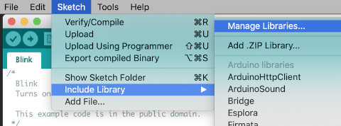

A la finestra del gestor de biblioteques d’Arduino, cerqueu el tipus de controlador d’una pantalla (p. ex. «SSD1325») i la biblioteca Adafruit adequada es pot trobar als resultats. Les biblioteques auxiliars necessàries ("dependències", com ara Adafruit_GFX o Adafruit_BusIO) ara s’instal·len automàticament. Si utilitzeu una versió antiga de l’EID d’Arduino, haureu de cercar i instal·lar manualment aquestes biblioteques addicionals.


Algunes de les biblioteques que operen al costat d’Adafruit_GFX
inclouen:

- [RGBmatrixPanel()](https://github.com/adafruit/RGB-matrix-Panel), per al nostre [16x32](http://adafru.it/420) i [32x32](http://adafru.it/607) Plafons de matriu LED RGB
- [Adafruit_TFTLCD ()](https://github.com/adafruit/TFTLCD-Library), per al nostre 2.8" [TFT LCD touchscreen breakout](http://adafru.it/335) i [TFT Touch Shield per Arduino](http://adafru.it/376)
- [Adafruit_HX8340B()](https://github.com/adafruit/Adafruit-HX8340B), per a la nostra [pantalla TFT de 2.2" amb microSD](http://adafru.it/797)
- [Adafruit_ST7735()](https://github.com/adafruit/Adafruit-ST7735-Library), per a la nostra [pantalla TFT 1.8" amb microSD](http://adafru.it/358)
- [Adafruit_PCD8544()](https://github.com/adafruit/Adafruit-PCD8544-Nokia-5110-LCD-library), per al [LCD monocrom de Nokia 5110/3310](http://adafru.it/338)
- [Adafruit-Graphic-VFD-Display-Library()](https://github.com/adafruit/Adafruit-Graphic-VFD-Display-Library), per al nostre [VFD gràfic 128x64](http://adafru.it/773)
- [Adafruit-SSD1331-OLED-Driver-Library-for-Arduino()](https://github.com/adafruit/Adafruit-SSD1331-OLED-Driver-Library-for-Arduino) per al [0,96" color de 16 bits OLED w/microSD Holder](http://adafru.it/684)
- [Adafruit_SSD1306()](https://github.com/adafruit/Adafruit_SSD1306) per al [Monochrome 128x64](http://adafru.it/326) i
  [128x32](http://adafru.it/661) OLEDs

I molts altres, excepte alguns productes "retirats" molt primerencs. Recordeu, només cerqueu el tipus de controlador de pantalla al gestor de la biblioteca Arduino, instal·leu-lo, i la resta ara és automàtic.

Les biblioteques estan escrites en C++ per a Arduino, però podrien ser fàcilment portades a qualsevol microcontrolador reescrivint les funcions d’accés a pins de baix nivell.

## La via antiga

Les versions més antigues del programari Arduino IDE requereixen instal·lar biblioteques manualment; el gestor de biblioteques Arduino encara no existia. Si s’utilitza una versió primerenca del programari Arduino, aquest podria ser un bon moment per actualitzar. Altrament, aquesta guia d’aprenentatge explica com instal·lar i utilitzar les biblioteques Arduino(). Aquí hi ha enllaços per baixar les biblioteques GFX i el BusIO directament (utilitzeu els enllaços anteriors per a obtenir les biblioteques específiques de visualització corresponents):

[_Descarrega Biblioteca Adafruit_GFX_](https://github.com/adafruit/Adafruit-GFX-Library/archive/master.zip)

[_Descarrega Biblioteca Adafruit_BusIO_](https://github.com/adafruit/Adafruit_BusIO/archive/master.zip)

## Accés a les funcions GFX

Qualsevol esbós d’Arduino que utilitzi Adafruit.GFX necessita `#incloure` dues biblioteques. Ho veureu en la majoria d’exemples, a prop de la part superior del codi. El primer, `Adafruit_GFX.h` , declara un conjunt comú de funcions gràfiques com formes i colors (explicades en pàgines posteriors). La segona depèn completament de qualsevol pantalla
que utilitzeu …​ podria ser `Adafruit_ST7789.h` (per a certes pantalles de color), `Adafruit_SSD1306.h` (per a certs OLED monocromats) o alguna altra cosa …​ la guia o la pàgina de producte per a la pantalla us dirà quina biblioteca instal·lar. La part superior d’un esbós s’assembla normalment a quelcom com això:

```arduino
#include <Adafruit_GFX.h>    // Core graphics library
#include <Adafruit_ST7789.h> // Hardware-specific library for ST7789
```

## Sistema de coordenades i unitats

Els píxels (elements d’imatge, els blocs que comprenen una imatge digital) s’adrecen mitjançant les seves coordenades horitzontals (X) i verticals (Y). El sistema de coordenades situa l’origen (0,0) a la cantonada superior esquerra, amb X positiu augmentant a la dreta i Y positiu augmentant cap avall. Això està al revés en relació amb el sistema de coordenades cartesianes estàndard de les matemàtiques, però és una pràctica establerta en molts sistemes gràfics per ordinador (un retorn als dies dels gràfics CRT d’escaneig ràster, que funcionaven de dalt a baix). Per utilitzar un disseny "retrat" alt en lloc d’un format "paisatge" ample, o si les restriccions físiques dicten l’orientació d’una pantalla en un recinte, també es pot aplicar una de les quatre configuracions de rotació, que indica quin racó de la pantalla representa la part superior esquerra .

També a diferència del sistema de coordenades cartesianes matemàtiques, els punts aquí tenen una dimensió: sempre tenen un píxel enter complet d’ample i alt.

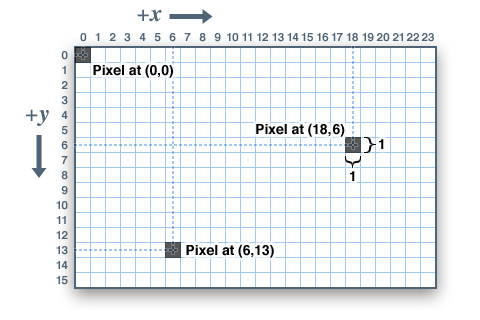

Les coordenades s’expressen sempre en unitats de píxels; no hi ha una escala implícita a una mesura del món real, com ara mil·límetres o polzades, i la mida d’un gràfic mostrat serà una funció del pas de punts o de la densitat de píxels d’aquesta pantalla específica. Si busqueu una dimensió del món real, haureu d’escalar les vostres coordenades perquè s’adaptin. Sovint es pot trobar el pas del punt al full de dades del dispositiu o mesurant l’amplada de la pantalla i dividint el nombre de píxels per aquesta mesura.

La biblioteca "retallarà" amb seguretat els gràfics extrets de les vores de la pantalla. De fet, això es fa a propòsit de vegades, com amb les pantalles de text de desplaçament.

Per a les pantalles amb color, els colors es representen com a valors de 16 bits sense signe. Algunes pantalles poden ser físicament capaços de més o menys bits que això, però la biblioteca funciona amb valors de 16 bits …​ són fàcils de treballar amb Arduino alhora que ofereix un tipus de dades coherent a totes les pantalles diferents. Els components del
color primari (vermell, verd i blau) estan tots "empaquetats" en una única variable de 16 bits, amb els 5 bits més significatius que transmeten el vermell, els 6 bits mitjans que transmeten el verd i els 5 bits menys significatius que transmeten el blau. Aquest bit addicional s’assigna al verd perquè els nostres ulls són més sensibles a la llum verda. Ciència!


Per als colors primaris i secundaris més comuns, tenim aquest pràctic full de trucs que podeu incloure al vostre propi codi. Per descomptat, podeu triar qualsevol dels 65.536 colors diferents, però aquesta llista bàsica pot ser la més fàcil quan comenceu:

```arduino
// Color definitions
#define BLACK    0x0000
#define BLUE     0x001F
#define RED      0xF800
#define GREEN    0x07E0
#define CYAN     0x07FF
#define MAGENTA  0xF81F
#define YELLOW   0xFFE0
#define WHITE    0xFFFF
```

En un altre lloc: [aquí hi ha una explicació detallada dels colors "RGB565" de 16 bits](https://translate.google.com/website?sl=auto&tl=ca&hl=ca&u=http://www.barth-dev.de/online/rgb565-color-picker/) que inclou un selector de colors interactiu (no compatible amb tots els navegadors).

Per a les pantalles monocromes (d’un sol color), els colors sempre s’especifiquen com a 1 (conjunt) o 0 (clar). La semàntica de set/clear és específica del tipus de pantalla: amb alguna cosa com una pantalla OLED lluminosa, un píxel "set" s’il·lumina, mentre que amb una pantalla LCD reflectant, un píxel "set" normalment és fosc. Pot haver-hi excepcions, però en general podeu comptar amb 0 (clar) que representa l’estat de fons predeterminat per a una pantalla acabada d’iniciar, sigui quin sigui.

## Gràfics Primitius

Cada biblioteca de visualització específica del dispositiu tindrà els
seus propis constructors i funcions d’inicialització. Es documenten als
tutorials individuals per a cada tipus de visualització, o sovint són
evidents al fitxer de capçalera de la biblioteca específic. La resta
d’aquest tutorial cobreix les funcions gràfiques habituals que
funcionen igual independentment del tipus de pantalla.

Les descripcions de les funcions següents són només prototips ; hi ha la
suposició que un objecte de visualització es declara i s’inicia segons
ho necessita la biblioteca específica del dispositiu. Mireu el codi
d’exemple amb cada biblioteca per veure’l en ús real. **Per exemple,
quan mostrem print(1234.56), el vostre codi real col·locaria el nom de
l’objecte abans d’aquest, per exemple, podria llegir
screen.print(1234.56)** (si heu declarat el vostre objecte de
visualització amb el nom screen).

### Dibuixar pixels (punts)

El primer és traçador de píxels més bàsic. Podeu anomenar-lo amb
coordenades X, Y i un color i farà un sol punt:

```arduino
void drawPixel(uint16_t x, uint16_t y, uint16_t color);
```

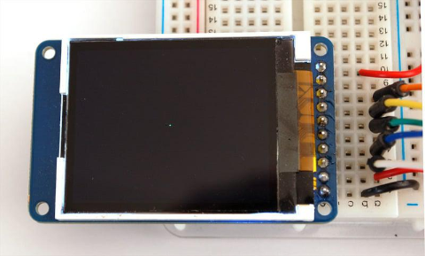

### Dibuixant línies

També podeu dibuixar línies, amb un punt inicial i final i un color:

```arduino
void drawLine(uint16_t x0, uint16_t y0, uint16_t x1, uint16_t y1, uint16_t color);
```

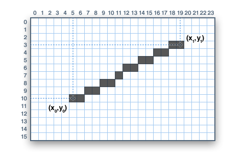

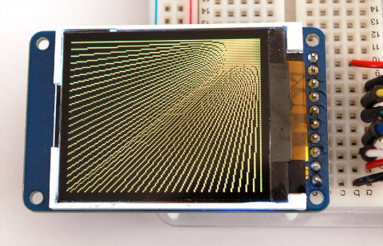

Per a línies horitzontals o verticals, hi ha funcions de dibuix de
línies optimitzades que eviten els càlculs angulars:

```arduino
void drawFastVLine(uint16_t x0, uint16_t y0, uint16_t length, uint16_t color);
void drawFastHLine(uint8_t x0, uint8_t y0, uint8_t length, uint16_t color);
```

### Rectangles

A continuació, es poden dibuixar i omplir rectangles i quadrats
mitjançant els procediments següents. Cadascun accepta una parella X, Y
per a la cantonada superior esquerra del rectangle, una amplada i una
alçada (en píxels) i un color. drawRect() representa només el marc
(contorn) del rectangle, l’interior no es veu afectat, mentre que
fillRect() omple tota l’àrea amb un color determinat:

```arduino
void drawRect(uint16_t x0, uint16_t y0, uint16_t w, uint16_t h, uint16_t color);
void fillRect(uint16_t x0, uint16_t y0, uint16_t w, uint16_t h, uint16_t color);
```

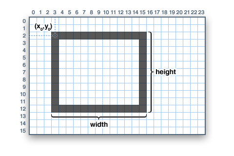

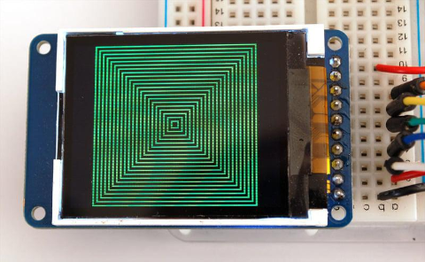

Per crear un rectangle sòlid amb un contorn contrastant, utilitzeu
primer `fillRect()` i després `drawRect()` sobre ell.

### Cercles

De la mateixa manera, per als cercles, podeu dibuixar i omplir. Cada
funció accepta un parell X, Y per al punt central, un radi en píxels i
un color:

```arduino
void drawCircle(uint16_t x0, uint16_t y0, uint16_t r, uint16_t color);
void fillCircle(uint16_t x0, uint16_t y0, uint16_t r, uint16_t color);
```

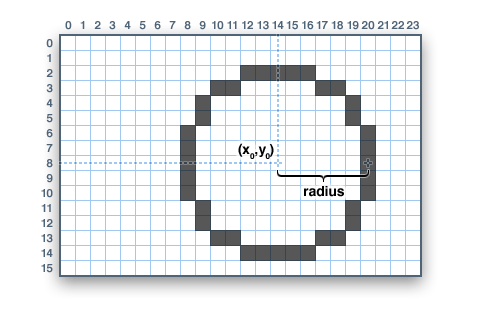


### Rectangles arrodonits

Per als rectangles amb cantonades arrodonides, les funcions de dibuix i
d’emplenament tornen a estar disponibles. Cadascun comença amb una X, Y,
amplada i alçada (igual que els rectangles normals), després hi ha un
radi de cantonada (en píxels) i finalment el valor del color:

```arduino
void drawRoundRect(uint16_t x0, uint16_t y0, uint16_t w, uint16_t h, uint16_t radius, uint16_t color);
void fillRoundRect(uint16_t x0, uint16_t y0, uint16_t w, uint16_t h, uint16_t radius, uint16_t color);
```

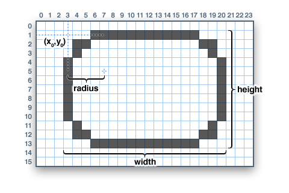

Aquí teniu un truc addicional: com que les funcions del cercle sempre es
dibuixen en relació amb un píxel central, el diàmetre del cercle
resultant sempre serà un nombre senar de píxels. Si es requereix un
cercle de mida uniforme (que col·locaria el punt central entre píxels),
això es pot aconseguir mitjançant una de les funcions del rectangle
arrodonit: passar una amplada i una alçada idèntiques que siguin valors
parells i un radi de cantonada que sigui exactament la meitat d’aquest.
valor.

### Triangles

Amb els triangles, una vegada més hi ha les funcions de dibuix i
ompliment. Cadascun requereix set paràmetres complets: les coordenades
X, Y dels tres punts de cantonada que defineixen el triangle, seguides
d’un color:

```arduino
void drawTriangle(uint16_t x0, uint16_t y0, uint16_t x1, uint16_t y1, uint16_t x2, uint16_t y2, uint16_t color);
void fillTriangle(uint16_t x0, uint16_t y0, uint16_t x1, uint16_t y1, uint16_t x2, uint16_t y2, uint16_t color);
```


### Caràcters i text

Hi ha dos procediments bàsics de dibuix de cadenes per afegir text. El
primer és només per a un sol caràcter. Podeu col·locar aquest caràcter a
qualsevol lloc i amb qualsevol color. Es pot passar un paràmetre de mida
opcional que escala el tipus de lletra per aquest factor (per exemple,
size=2 renderà el tipus de lletra predeterminat a 10x16 píxels per
caràcter). D’aquesta manera és una mica a pinyó, però tenir només un
sol tipus de lletra ajuda a reduir la mida del programa.

```arduino
void drawChar(uint16_t x, uint16_t y, char c, uint16_t color, uint16_t bg, uint8_t size);
```


El text és molt flexible, però funciona una mica diferent. En lloc d’un
procediment, la mida del text, el color i la posició es configuren en
funcions separades i després s’utilitza la funció print() - això ho
facilita i proporciona totes les mateixes capacitats de format de cadena
i nombres del familiar [Serial.print() d’Arduino i les funcions
println()](https://www.arduino.cc/reference/en/language/functions/communication/serial/print/)
! Però els precedeixes amb l’objecte de visualització en lloc de
Serial.

```arduino
void setCursor(int16_t x0, int16_t y0);
void setTextColor(uint16_t color);
void setTextColor(uint16_t color, uint16_t backgroundcolor);
void setTextSize(uint8_t size);
void setTextWrap(boolean w);
```

Comenceu amb `setCursor(x, y)`, que col·locarà la cantonada superior
esquerra del text allà on vulgueu. Inicialment s’estableix a (0,0) (la
cantonada superior esquerra de la pantalla). A continuació, establiu el
color del text amb `setTextColor(color)` — per defecte és blanc. El text
normalment es dibuixa `` `clar": les parts obertes de cada caràcter
mostren el contingut de fons original, però si voleu que el text
bloquegi el que hi ha a sota, es pot especificar un color de fons com a
segon paràmetre opcional per `setTextColor() ``. Finalment,
`setTextSize(size)` multiplicarà l’escala del text per un factor enter
donat. A continuació podeu veure escales d’1 (el predeterminat), 2 i 3.
A mides més grans apareix en blocs perquè només enviem la biblioteca amb
un sol tipus de lletra senzill, per estalviar espai.

> El color de fons del text no és compatible amb els tipus de lletra
> personalitzats (s’explica a la pàgina "Ús de tipus de lletra").
> Per a aquests, haureu de determinar l’extensió del text i dibuixar
> explícitament un rectangle ple abans de dibuixar el text. Això és a
> propòsit i per disseny.

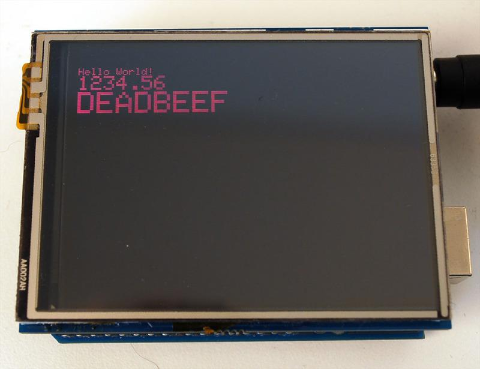

Després de configurar-ho tot, podeu utilitzar `print()` o `println()`,
igual que ho feu amb la impressió en sèrie ! Per exemple, per imprimir
una cadena, utilitzeu `print("Hola món")`: aquesta és la primera línia
de la imatge de dalt. També podeu utilitzar `print()` per a números i
variables: la segona línia de dalt és la sortida de `print(1234.56)` i
la tercera línia és `print(0xDEADBEEF, HEX).`

De manera predeterminada, les línies llargues de text estan configurades
per tornar automàticament a la columna més esquerra. Per anul·lar aquest
comportament (de manera que el text sortirà del costat dret de la
pantalla, útil per desplaçar-se amb efectes de marquesina), utilitzeu
`setTextWrap(false)`. El comportament normal d’embolcall es restaura amb
`setTextWrap(true)`.

### Caràcters ampliats, CP437 i un error a l’aguait

El tipus de lletra incorporat estàndard inclou una sèrie de símbols i
caràcters accentuats fora de les lletres i números normals que
utilitzaríeu a les cadenes `print()`. Es pot accedir a aquests amb
`drawChar()`, passant un valor de 8 bits (0-255, tot i que normalment
s’expressa en hexadecimal, 0x00-0xFF) per al tercer argument.

El tipus de lletra integrat es basa en el conjunt de caràcters original
d’IBM PC, conegut com a pàgina de codi 437 (CP437 per abreujar) . Molts
sistemes encastats encara l’utilitzen perquè és compacte i està ben
establert.

Fa anys, quan es va transcriure originalment CP437 a la biblioteca GFX,
es va ometre accidentalment un símbol. Res fatal, el codi funciona bé,
però tots els símbols posteriors es van desactivar per una comparació
amb el conjunt de caràcters CP437 "real". Quan això es va descobrir,
s’havia escrit tant de codi (projectes compartits en línia, però també
en mitjans fixos com llibres i revistes) que arreglar l’error trencaria
tots els projectes existents que es basaven en aquests caràcters
estesos!

Per tant, l’error s’ha deixat al seu lloc, a propòsit, però això crea un
problema diferent si s’està adaptant el codi d’un altre lloc que es basa
en els valors de símbol CP437 correctes .

Una solució de compromís és una funció que activa o desactiva la
seqüència "real" del CP437. De manera predeterminada, està
desactivat, s’utilitza l’ordre off-by-one, de manera que tots els
projectes GFX antics dels llibres funcionin sense modificacions. L’ordre
correcte es pot activar amb:

```arduino
display.cp437(true);
```

Normalment només s’ha de fer una vegada, a la funció\`setup()\`.

Aquí teniu un mapa del conjunt de caràcters integrat, tant la versió
errònia estàndard com la versió corregida que s’utilitza quan es truca
a cp437(true). Tingueu en compte que això només afecta les últimes cinc
files de símbols; tot el que és anterior al caràcter 0xB0 no es veu
afectat:

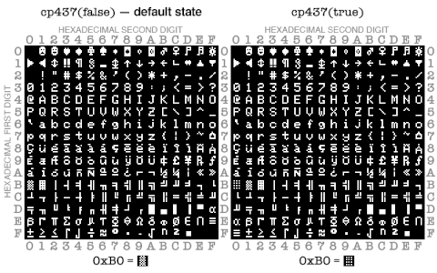

_La presència dels símbols ampliats de la Pàgina de Codi 437 només està
garantida en el tipus de lletra incorporat. Els tipus de lletra
personalitzats (explicats en altres llocs) poques vegades els inclouen._

Els caràcters ampliats normalment no es poden imprimir directament en
codi; la majoria dels editors poden admetre cadenes Unicode , però això
no s’assigna directament a CP437. Normalment es crida la write()funció
amb números de caràcters individuals. La biblioteca GFX es remunta a una
època anterior en què el suport Unicode no estava molt estès.

Penseu en la paraula alemanya Schön (bella). Es podria imprimir això
així:

```arduino
display.cp437(true);   // Use correct CP437 character codes
display.print("Scho"); // Print the plain ASCII first part
display.write(0x94);   // Print the o-with-umlauts
display.println("n");  // Print the last part
```

De la mateixa manera amb l’accés als símbols matemàtics …​

```arduino
display.cp437(true);  // Use correct CP437 character codes
display.print("Temperature: ");
display.print(number);
display.write(0xF8);  // Print the degrees symbol
display.println();    // New line
```

El suport del compilador per a alguns (no tots) microcontroladors de 32
bits proporciona la funció `printf()`, que pot permetre que aquests
caràcters es col·loquin en línia mitjançant el caràcter `%c`
identificador de format:

```arduino
display.cp437(true);
display.printf("Temperature: %d%c\n", number, 0xF8);
display.printf("Sch%cn\n", 0x94);
```

Això és agradable i compacte, però no és compatible amb tots els
microcontroladors, sens dubte no amb els primers dispositius de la
classe Arduino Uno, així que considereu com podeu compartir codi i
feu-lo servir amb cura.

Consulteu la pàgina [" Ús de tipus de lletra
"](https://learn.adafruit.com/adafruit-gfx-graphics-library/using-fonts)
per obtenir funcions de text addicionals a la darrera biblioteca de GFX.

### Mapes de bits

Podeu dibuixar petits mapes de bits monocroms (d’un sol color), ideals
per a sprites i altres mini-animacions o icones:

```arduino
void drawBitmap(int16_t x, int16_t y, uint8_t *bitmap, int16_t w, int16_t h, uint16_t color);
```

Això emet un bloc contigu de bits a la pantalla, on cada bit "1"
estableix el píxel corresponent en "color", mentre que cada bit
"0" es salta. x, y és la cantonada superior esquerra on es dibuixa
el mapa de bits, w, h són l’amplada i l’alçada en píxels.

Les dades del mapa de bits s’han de localitzar a la memòria del programa
mitjançant la directiva PROGMEM. Aquesta és una funció una mica avançada
i es recomana als principiants que hi tornin més tard. Per obtenir una
introducció, consulteu el [tutorial d’Arduino sobre l’ús de
PROGMEM](http://arduino.cc/en/Reference/PROGMEM) .

[Aquí teniu una eina web útil per generar mapes de bits → mapes de
memòria](http://javl.github.io/image2cpp/)

### Esborrar o omplir la pantalla

La funció `fillScreen()` establirà tota la pantalla amb un color
determinat, esborrant qualsevol contingut existent:

```arduino
void fillScreen(uint16_t color);
```

### Funcions específiques de maquinari

Algunes pantalles poden tenir funcions úniques com la inversió de
pantalla o el desplaçament basat en maquinari. La documentació
d’aquestes funcions es pot trobar a la guia específica de la pantalla
corresponent. Com que aquestes no són característiques comunes a totes
les pantalles compatibles amb GFX, no es descriuen aquí.

## Girar la pantalla

També pots girar el dibuix. Tingueu en compte que això no girarà el que
ja heu dibuixat, però canviarà el sistema de coordenades per a qualsevol
dibuix nou. Això pot ser molt útil si has de girar la taula o mostrar-la
de costat o cap per avall per encaixar en un recinte en particular. En
la majoria dels casos això només s’ha de fer una vegada, dins de
setup(). Només podem girar 0, 90, 180 o 270 graus - qualsevol altra cosa
no és possible en maquinari i és massa complicat perquè un Arduino ho
calculi en programari.


```arduino
void setRotation(uint8_t rotation);
```

El paràmetre de rotació pot ser 0, 1, 2 o 3. Per a les pantalles que
formen part d’un escut d’Arduino, el valor de rotació 0 estableix la
pantalla a un mode de retrat, amb l’USB a la part superior dreta. El
valor de rotació 2 també és un mode de retrat, amb l’USB a la part
inferior esquerra. La rotació 1 és el mode horitzontal, amb l’USB a la
part inferior dreta, mentre que la rotació 3 també és horitzontal, però
amb l’USB a la part superior esquerra.

Per a altres pantalles, proveu les 4 rotacions per a esbrinar com acaben
girant, ja que l’alineació variarà depenent de cada pantalla, en general
les rotacions es mouen en sentit antihorari

En girar, el punt d’origen (0,0) canvia — la idea és que s’ha
d’organitzar a la part superior esquerra de la pantalla perquè les
altres funcions gràfiques tinguin sentit coherent (i coincideixin amb
totes les descripcions de funcions anteriors).

Si necessiteu fer referència a la mida de la pantalla (que canviarà
entre els modes retrat i paisatge), utilitzeu width() i height().

```arduino
uint16_t width();
uint16_t height();
```

Cada un retorna la dimensió (en píxels) de l’eix corresponent, ajustada
per a la configuració de rotació actual de la pantalla.

## Ús de fonts

Les versions més recents de la biblioteca Adafruit GFX ofereixen la
possibilitat d’utilitzar fonts alternatives a més de la font estàndard
de mida fixa i espaiada que té per defecte. S’hi inclouen diverses fonts
alternatives, a més d’una possibilitat d’afegir-ne de noves.


Els tipus de lletra inclosos es deriven del projecte GNU FreeFont. Hi ha
tres estils: "Serif" (reminiscència de Times New Roman), "Sans"
(reminiscència de Helvetica o Arial) i "Mono" (reminiscència de
Courier). Cadascuna d’elles està disponible en uns pocs estils (bold,
italic, etc.) i mides. Els tipus de lletra inclosos estan en un format
de mapa de bits, no en vectors escalables, ja que necessita treballar
dins de les limitacions d’un petit microcontrolador.

Ubicats en la carpeta "Fonts" dins d’Adafruit_GFX, els fitxers
inclosos (a partir d’aquesta escriptura) són:

```arduino
FreeMono12pt7b.h        FreeSansBoldOblique12pt7b.h
FreeMono18pt7b.h        FreeSansBoldOblique18pt7b.h
FreeMono24pt7b.h        FreeSansBoldOblique24pt7b.h
FreeMono9pt7b.h         FreeSansBoldOblique9pt7b.h
FreeMonoBold12pt7b.h        FreeSansOblique12pt7b.h
FreeMonoBold18pt7b.h        FreeSansOblique18pt7b.h
FreeMonoBold24pt7b.h        FreeSansOblique24pt7b.h
FreeMonoBold9pt7b.h     FreeSansOblique9pt7b.h
FreeMonoBoldOblique12pt7b.h FreeSerif12pt7b.h
FreeMonoBoldOblique18pt7b.h FreeSerif18pt7b.h
FreeMonoBoldOblique24pt7b.h FreeSerif24pt7b.h
FreeMonoBoldOblique9pt7b.h  FreeSerif9pt7b.h
FreeMonoOblique12pt7b.h     FreeSerifBold12pt7b.h
FreeMonoOblique18pt7b.h     FreeSerifBold18pt7b.h
FreeMonoOblique24pt7b.h     FreeSerifBold24pt7b.h
FreeMonoOblique9pt7b.h      FreeSerifBold9pt7b.h
FreeSans12pt7b.h        FreeSerifBoldItalic12pt7b.h
FreeSans18pt7b.h        FreeSerifBoldItalic18pt7b.h
FreeSans24pt7b.h        FreeSerifBoldItalic24pt7b.h
FreeSans9pt7b.h         FreeSerifBoldItalic9pt7b.h
FreeSansBold12pt7b.h        FreeSerifItalic12pt7b.h
FreeSansBold18pt7b.h        FreeSerifItalic18pt7b.h
FreeSansBold24pt7b.h        FreeSerifItalic24pt7b.h
FreeSansBold9pt7b.h     FreeSerifItalic9pt7b.h
```

Cada nom de fitxer comença amb el nom de la font ("FreeMono", "FreeSerif", etc.) seguit de l’estil ("Bold", "Oblique", none, etc.), la mida de la lletra en punts (actualment es proporcionen 9, 12, 18 i 24 mides de punts) i "7b" per indicar que aquests contenen caràcters de 7 bits (codis ASCII “ ” a través de “~”); les lletres de 8 bits (símbols de suport i/o caràcters internacionals) encara no es proporcionen però poden venir més tard.

### Ús de fonts GFX en esbossos d’Arduino

Després de `#include AdafruitGFX` i les biblioteques específiques de
visualització, incloeu el/s fitxer/s de tipus de lletra que voleu
utilitzar al vostre esbós. Per exemple:

```arduino
#include <Adafruit_GFX.h>    // Core graphics library
#include <Adafruit_TFTLCD.h> // Hardware-specific library
#include <Fonts/FreeMonoBoldOblique12pt7b.h>
#include <Fonts/FreeSerif9pt7b.h>
```

Cada tipus de lletra ocupa una mica d’espai de programa; els tipus de
lletra més grans normalment requereixen més espai. Aquest és un recurs
finit (aproximadament 32K max en un Arduino Uno per a les dades de tipus
de lletra i tot el codi del vostre esbós), així que trieu amb cura. Si
és massa gran, el codi es negarà a compilar (o en alguns casos
concrets, pot compilar però després no pujarà al tauler). Si això passa,
utilitzeu menys fonts o tipus de lletra més menuts, o utilitzeu el tipus
de lletra integrat estàndard.

Dins d’aquests fitxers .h hi ha diverses estructures de dades, inclosa
una estructura de tipus de lletra principal que normalment tindrà el
mateix nom que el fitxer de tipus de lletra (menys el .h). Per a
seleccionar un tipus de lletra per a les operacions gràfiques
posteriors, utilitzeu la funció `setFont()`, passant l’adreça d’aquesta
estructura, com ara:

```arduino
tft.setFont(&FreeMonoBoldOblique12pt7b);
```

Les crides posteriors a `tft.print()` ara usaran aquest tipus de lletra.
La majoria dels altres atributs que anteriorment treballaven amb el
tipus de lletra incorporat (color, mida, etc.) funcionen de manera
similar aquí.

Per a tornar al tipus de lletra estàndard de mida fixa, crideu
`setFont()`, passant NULL o cap argument:

```arduino
tft.setFont();
```

Podeu veure un exemple complet de tipus de lletra personalitzats en
acció al codi font de [MagTag Quotes
Codi](https://learn.adafruit.com/adafruit-magtag/quotes-example). En
realitat són només unes quantes línies addicionals en comparació amb un
programa de text GFX "normal".

Alguns atributs de text es comporten de manera una mica diferent amb
aquests nous tipus de lletra. Sense voler trencar la compatibilitat amb
el codi existent, el tipus de lletra «clàssic» continua comportant-se
com abans.

Per exemple, mentre que la posició del cursor quan s’imprimeix amb el
tipus de lletra clàssic identifica la cantonada superior esquerra de la
cel·la de caràcter, amb els tipus de lletra nous la posició del cursor
indica la línia de base —la fila inferior de més amunt— del text
posterior. Els caràcters poden variar en mida i amplada, i no
necessàriament comencen a la columna exacta del cursor (com a sota,
aquest caràcter comença un píxel a l’esquerra del cursor, però altres
poden estar a sobre o a la dreta).

En canviar entre els tipus de lletra integrats i els personalitzats, la
biblioteca desplaçarà automàticament la posició del cursor cap amunt o
cap avall 6 píxels segons sigui necessari per a continuar al llarg de la
mateixa línia de base.

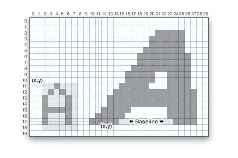

Una cosa que s’ha de tenir en compte amb els tipus de lletra nous: no hi
ha cap opció de color «background» …podeu establir aquest valor, però
s’ignorarà.

**Això és a propòsit i per disseny.**

La característica de color de fons s’utilitza de vegades amb el tipus de
lletra «clàssic» per sobreescriure el contingut de la pantalla antiga
amb dades noves. Això només funciona perquè aquests caràcters tenen una
mida uniforme; això no funcionarà amb tipus de lletra proporcionalment
espaiats, on els límits d’una cadena poden variar, i un nombre
indeterminat de caràcters poden superposar-se a la mateixa regió.

Per a substituir el text dibuixat prèviament quan s’utilitza un tipus de
lletra personalitzat, qualsevol de les dues opcions:

- **Utilitzeu getTextBounds()** per a determinar el rectangle més petit que engloba una cadena, esborreu l’àrea utilitzant fillRect() i, a continuació, dibuixeu text nou:

  ```àrduino
  int16_t  x1, y1;
  uint16_t w, h;

  tft.getTextBounds(string, x, y, &x1, &y1, &w, &h);
  ```

  `getTextBounds` espera una cadena, una posició X\&Y del cursor
  inicial (la posició actual del cursor no s’alterarà), i adreces de
  dos enters de 16 bits sigamb signenats i dos sense signe. Aquests
  últims quatre valors contindran la cantonada superior esquerra i
  l’amplada i alçada de l’àrea coberta per aquest text — aquests es
  poden passar directament com a arguments a `fillRect()`.

  Malauradament, això "parpellejarà" el text quan s’esborri i es
  torni a dibuixar, però és inevitable. L’esquema antic de dibuixar
  píxels de fons en el mateix pas només crea un conjunt nou de
  problemes.

- **Creeu un objecte GFXcanvas1** (un mapa de bits fora de pantalla) per a una àrea de mida fixa, dibuixeu-hi text personalitzat i copieu-lo a la pantalla utilitzant drawBitmap().

  ```arduino
  // In global declarations:
  GFXcanvas1 canvas(128, 32); // 128x32 pixel canvas

  // In code later:
  canvas.println("I like cake");
  tft.drawBitmap(x, y, canvas.getBuffer(), 128, 32, foreground, background); // Copy to screen
  ```

  Això és il·lustratiu de la sintaxi, no d’un programa complet:
  canvieu x, y, primer pla i fons a les coordenades desitjades i els
  valors de color adequats a la pantalla. Algunes pantalles també
  requereixen una crida explícita `display()` o `show()` per
  actualitzar el contingut de la pantalla.

Això estarà lliure de parpelleig però requereix més RAM (aproximadament
512 bytes per al llenç de píxels 128x32 mostrat més amunt), per la qual
cosa no sempre és pràctic en taulers AVR amb només 2K. Arduino Mega o
qualsevol tauler de 32 bits haurien de funcionar sense cap problema.

Per a més informació sobre l’ús de llenços, vegeu la pàgina "Minimizing Redraw Flicker".

### Afegint tipus de lletra nous

Si voleu crear noves mides de lletra no incloses amb la biblioteca, o
adaptar-les completament, tenim una eina de línia d’ordres (a la carpeta
«fontconvert») per a això. Hauria de funcionar en molts sistemes
similars a Linux o UNIX (Raspberry Pi, Mac OS X, potser Cygwin per a
Windows, entre d’altres).

La construcció d’aquesta eina requereix el compilador gcc i la
biblioteca [FreeType](http://www.freetype.org/). La majoria de
distribucions de Linux inclouen ambdues per defecte. Per a d’altres, és
possible que necessiteu instal·lar eines de desenvolupament i
descarregar i [construir FreeType des de la
font](http://download.savannah.gnu.org/releases/freetype/). A
continuació, editeu el Makefile perquè coincideixi amb la vostra
configuració abans d’invocar «make».

`fontconvert` espera com a mínim dos arguments: un nom de fitxer de
tipus de lletra (com ara un tipus de lletra vectorial TrueType
escalable) i una mida, en punts (72 punts = 1 polzada; el codi presumeix
una resolució de pantalla similar a les pantalles TFT d’Adafruit 2.8").
La sortida s’ha de redirigir a un fitxer .h …podeu cridar això com
vulgueu però intento ser una mica descriptiu:

```arduino
./fontconvert myfont.ttf 12 > myfont12pt7b.h
```

Els fitxers GNU FreeFont no s’inclouen al repositori de la biblioteca,
però es descarreguen fàcilment. O pots convertir la major part de
qualsevol tipus de lletra que vulguis.

El nom assignat a l’estructura del tipus de lletra dins d’aquest fitxer
es basa en el nom del fitxer d’entrada i la mida del tipus de lletra, no
en la sortida. És per això que recomano utilitzar noms de fitxer
descriptius que incorporin el nom base de la font, la mida i «7b». A
continuació, el nom de fitxer i el nom de l’estructura de tipus de
lletra .h poden coincidir.

El fitxer .h resultant es pot copiar a la carpeta Adafruit.GFX/Fonts, o
podeu importar el fitxer com una pestanya nova al vostre esbós Arduino
utilitzant l’ordre Esbós.Afegeix un fitxer ….

Si es troba a la carpeta Fonts, utilitzeu aquesta sintaxi quan inclogueu
el fitxer:

```arduino
#include <Fonts/myfont12pt7b.h>
```

Si hi ha una pestanya dins del vostre croquis, utilitzeu aquesta
sintaxi:

```arduino
#include "myfont12pt7b.h"
```

## Carregant imatges

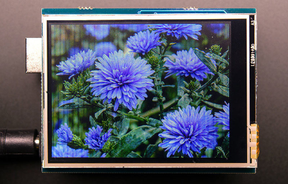

La càrrega d’imatges .BMP des d’una targeta SD (o el xip de memòria
flaix en els taulers Adafruit "Express") és una opció per a la
majoria de les nostres pantalles de color … encara que no està integrat
en Adafruit.GFX i s’ha d’instal·lar per separat.

La biblioteca **Adafruit.ImageReader** gestiona aquesta tasca. Es pot
instal·lar a través del gestor de biblioteques Arduino (Sketch→Include
Library→Manage Libraries …). Introduïu «imageread» al camp de cerca i la
biblioteca és fàcil de trobar:

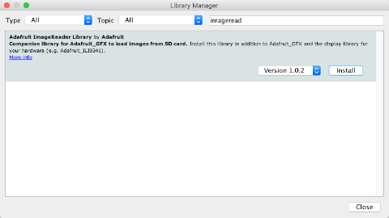

Mentre estiguis a la gestio de biblioteques, busca també la biblioteca
**Adafruit.SPIFlash** i instal·la-la de manera similar.

Hi ha una biblioteca més necessària, però no es pot instal·lar a través
del Gestor de Biblioteques. L’**Adafruit fork** de la biblioteca
[**SdFat**](https://github.com/adafruit/SdFat/archive/master.zip) s’ha
de descarregar com a fitxer .ZIP, descomprimir i instal·lar la
[biblioteca Arduino de la via de la vella
escola](https://learn.adafruit.com/adafruit-all-about-arduino-libraries-install-use/how-to-install-a-library).

### Ús de la biblioteca Adafruit ImageReader

La sintaxi per a l’ús d’aquesta biblioteca (i la instal·lació separada
anterior) és certament una mica peculiar …és un efecte secundari de la
manera en què Arduino maneja les biblioteques. A propòsit, no ho hem
introduït a Adafruit GFX perquè qualsevol simple esment d’una biblioteca
de targetes SD incorrerà en tots els considerables requisits de memòria
d’aquesta biblioteca … fins i tot si el croquis no utilitza cap targeta
SD! La majoria dels projectes gràfics són autocontinguts i no fan
referència a fitxers d’una targeta … no tothom necessita aquesta
funcionalitat.

Hi ha diversos esbossos d’exemple a la carpeta
**Adafruit_ImageReader/examples**. Es recomana que les disseccioneu per
a idees sobre com utilitzar la biblioteca en els vostres propis
projectes.

Tots comencen amb diversos \#includes …

```arduino
#include <Adafruit_GFX.h>         // Core graphics library
#include <Adafruit_ILI9341.h>     // Hardware-specific library
#include <SdFat.h>                // SD card & FAT filesystem library
#include <Adafruit_SPIFlash.h>    // SPI / QSPI flash library
#include <Adafruit_ImageReader.h> // Image-reading functions
```

Una d’aquestes línies pot variar d’un exemple a l’altre, depenent del
maquinari de visualització en el que s’hagi escrit perquè es puga
suportar. A dalt veiem que s’utilitza amb la biblioteca Adafruit.ILI9341
requerida per certs escuts o plaques de prototipat. Altres exemples
referèncien Adafruit.HX8357, Adafruit.ST7735, o altres biblioteques de
visualització TFT o OLED de color …utilitzeu la correcta per al
maquinari que teniu.

La majoria dels exemples poden funcionar des d’una **targeta SD**, o des
d’una petita **unitat d’emmagatzematge flash** que es troba en unes
certes plaques Adafruit "Express". El codi per a inicialitzar un o
l’altre és una mica diferent, i els exemples comproven que
**USE_SD_CARD** està definit per a seleccionar un mètode o l’altre. Si
sabeu que el vostre propi projecte només ha d’executar-se en un o altre
tipus, realment només necessiteu la inicialització corresponent.

Per a l’ús de la targeta SD, es declaren aquests dos globals:

```arduino
SdFat                SD;         // SD card filesystem
Adafruit_ImageReader reader(SD); // Image-reader object, pass in SD filesys
```

Per a un sistema de fitxers flaix, hi ha algunes declaracions especials
que ens ajuden a localitzar el dispositiu flaix en diferents plaques
Express i, a continuació, declareu tres globals:

```arduino
// SPI or QSPI flash filesystem (i.e. CIRCUITPY drive)
#if defined(__SAMD51__) || defined(NRF52840_XXAA)
  Adafruit_FlashTransport_QSPI flashTransport(PIN_QSPI_SCK, PIN_QSPI_CS,
    PIN_QSPI_IO0, PIN_QSPI_IO1, PIN_QSPI_IO2, PIN_QSPI_IO3);
#else
  #if (SPI_INTERFACES_COUNT == 1)
    Adafruit_FlashTransport_SPI flashTransport(SS, &SPI);
  #else
    Adafruit_FlashTransport_SPI flashTransport(SS1, &SPI1);
  #endif
#endif
Adafruit_SPIFlash    flash(&flashTransport);
FatFileSystem        filesys;
Adafruit_ImageReader reader(filesys); // Image-reader, pass in flash filesys
```

L’objecte «reader» s’utilitzarà per accedir a les funcions de càrrega
d’imatges més endavant.

Llavors … declarem un objecte de visualització (anomenat "tft" en la
majoria dels exemples) de la manera habitual …per exemple, amb l’escut
tàctil TFT de 2.8 polzades per a Arduino, és:

```arduino
#define SD_CS   4 // SD card select pin
#define TFT_CS 10 // TFT select pin
#define TFT_DC  9 // TFT display/command pin

Adafruit_ILI9341 tft = Adafruit_ILI9341(TFT_CS, TFT_DC);
```

Tot té lloc a la secció de la variable global, fins i tot abans de la
funció setup().

Ara hem de fer alguna feina a setup(), i de nou és diferent per a
targetes SD que per a sistemes de fitxers flash …

Per a l’ús de la targeta SD, podria semblar així:

```arduino
  if(!SD.begin(SD_CS, SD_SCK_MHZ(25))) { // ESP32 requires 25 MHz limit
    Serial.println(F("SD begin() failed"));
    for(;;); // Fatal error, do not continue
  }
```

Aquest exemple està proporcionant una gestió d’errors molt bàsica. Comproveu l’estat de retorn de `SD.begin()` i imprimiu un missatge al
monitor de sèrie si hi ha un problema.

L’ús d’un sistema de fitxers flaix requereix dos passos:

```arduino
  if(!flash.begin()) {
    Serial.println(F("flash begin() failed"));
    for(;;);
  }
  if(!filesys.begin(&flash)) {
    Serial.println(F("filesys begin() failed"));
    for(;;);
  }
```

**Tots els altres codis són ara els mateixos independentment de si
s’utilitza una targeta SD o un flaix**. Aquesta configuració o
qualsevol d’elles requeria alguns passos addicionals, però ara tot és
navegació suau

Després que s’hagin cridat les funcions SD (o flash) i `begin()` de TFT,
podeu cridar a `reader.drawBMP()` per a carregar una imatge BMP des de
la targeta a la pantalla:

```arduino
ImageReturnCode stat;
stat = reader.drawBMP("/purple.bmp", tft, 0, 0);
```

Això accepta quatre arguments:

- Un nom de fitxer en el format «8.3» (no hauríeu de proporcionar un camí absolut (el «/»), però hi ha alguns problemes amb la biblioteca SD en alguns taulers d’avantguarda com l’ESP32, així que endavant i incloeu-ho per a una bona mesura).

- L’objecte de visualització on es dibuixarà la imatge (p. ex. «tft»).
  Aquesta és la sintaxi estranya anteriorment esmentada … més que
  tft.drawBMP(), és reader.drawBMP(tft), perquè les raons.

- Una coordenada X i Y on es col·loca la cantonada superior esquerra
  de la imatge (això no necessita estar dins dels límits de la
  pantalla … la biblioteca retallarà la imatge a mesura que es
  carregui). 0, 0 dibuixarà la imatge a la cantonada superior esquerra
  …de manera que si les dimensions de la imatge coincideixen amb les
  dimensions de la pantalla, omplirà tota la pantalla.

Aquesta funció retorna un valor del tipus `ImageReturnCode`, que podeu
ignorar o utilitzar per a proporcionar alguna funcionalitat de
diagnòstic. Els valors possibles són:

- `IMAGE_SUCCESS` — La imatge s’ha carregat correctament (o s’ha
  retallat completament fora de la pantalla, encara es considera
  «èxit» en el sentit que no hi ha hagut cap error).

- `IMAGE_ERR_FILE_NOT_FOUND` — No s’ha pogut obrir el fitxer
  sol·licitat (comproveu l’ortografia, confirmeu que el fitxer
  existeix realment a la targeta, assegureu-vos que s’ajusta a la
  convenció de noms de fitxers «8.3» (p. ex. «filename.bmp»).

- `IMAGE_ERR_FORMAT` — No és un format d’imatge compatible. Actualment
  només s’admeten BMPs de color de 24 bits sense comprimir (és
  probable que se n’afegeixin més amb el temps).

- `IMAGE_ERR_MALLOC` — No s’ha pogut assignar memòria per a l’operació
  (drawBMP() no generarà aquest error, però altres funcions
  ImageReader podrien).

En lloc de tractar amb aquests valors, podeu cridar opcionalment a una
funció per a mostrar un missatge de diagnòstic bàsic a la consola sèrie:

```arduino
reader.printStatus(stat);
```

Si necessiteu saber la mida d’una imatge BMP sense carregar-la, hi ha la
funció `bmpDimensions()`:

```arduino
int32_t width, height;
stat = reader.bmpDimensions("/parrot.bmp", &width, &height);
```

Això accepta tres arguments:

- Un nom de fitxer, les mateixes regles que la funció `drawBMP()`.

- **Punters a dos enters de 32 bits**. En completar-se correctament,
  el seu contingut s’establirà a l’amplada i alçada de la imatge en
  píxels. En cas d’error, aquests valors s’han d’ignorar (es deixen
  sense inicialitzar).

Aquesta funció retorna un `ImageReturnCode` tal com s’explica amb la
funció `drawBMP()` anterior.

### Càrrega i ús d’imatges a la RAM

Depenent de la mida de la imatge i altres factors, carregar una imatge
des de la targeta SD a la pantalla pot trigar diversos segons. Les
imatges petites … aquelles que poden cabre completament en la RAM … es
poden carregar una vegada i utilitzar repetidament. Això pot ser útil
per a icones d’ús freqüent o sprites, ja que normalment és molt més
fàcil que convertir i incrustar una imatge com una matriu directament
en el codi … un procés horrible.

Això introdueix una altra funció ImageReader més un nou tipus d’objecte,
`Adafruit_Image`:

```arduino
Adafruit_Image img;
stat = reader.loadBMP("/wales.bmp", img);
```

`loadBMP()` accepta dos arguments:

- Un nom de fitxer, les mateixes regles que les funcions anteriors.

- Un objecte `Adafruit_Image`. Aquest és un tipus lleugerament més
  flexible que els mapes de bits utilitzats per algunes funcions de
  dibuix a la biblioteca GFX.

Això retorna un `ImageReturnCode` com s’ha descrit anteriorment. Si una
imatge és massa gran per a cabre en la RAM disponible, es retornarà un
valor d’`IMAGE_ERR_MALLOC`. Les imatges de color requereixen dos bytes
per píxel …per exemple, una imatge de 100x25 píxels necessitaria
100\*25\*2 = 5.000 bytes RAM.

En cas d’èxit, l’objecte `img` contindrà la imatge en RAM.

La funció `loadBMP()` només és útil en microcontroladors amb una RAM
considerable, com els taulers Adafruit «M0» i «M4», o ESP32. Els petits
dispositius com l’Arduino Uno no poden tallar-lo. Pot ser útil en
l’Arduino Mega amb imatges molt petites.

Després de carregar, utilitzeu la funció `img.draw()` per a mostrar una
imatge a la pantalla:

```arduino
img.draw(tft, x, y);
```

Això accepta tres arguments:

- Un objecte de visualització (p. ex. «tft» en la majoria dels
  exemples), similar a com funcionava `drawBMP()`.

- Una coordenada X i Y per a la cantonada superior esquerra de la
  imatge a la pantalla, de nou similar a `drawBMP()`.

Utilitzem `img.draw(tft,…​)` en lloc de `tft.drawRGBBitmap(…​)` (o
altres funcions de dibuix de mapes de bits a la biblioteca Adafruit.GFX)
perquè en el futur tenim previst afegir més flexibilitat respecte als
formats i tipus de fitxers d’imatge. L’objecte `Adafruit_Image`
"entén" una mica la imatge que s’ha carregat i cridarà
automàticament la funció de renderització de mapes de bits adequada, no
haureu de gestionar cada cas separat pel vostre compte.

Si la imatge no s’ha pogut carregar per qualsevol raó, `img.draw()`
encara es pot cridar, simplement no farà res. Però almenys l’esbós no
fallarà.

**No hi ha cap funció BMP-to-flash**. Això és a propòsit i per disseny.
Fem una cosa similar a la del projecte
[M4_Eyes](https://learn.adafruit.com/adafruit-monster-m4sk-eyes/compiling-from-source-code)
i pots buscar aquest codi per obtenir informació, però en general, això
està plagat de perill i no és una cosa que et recomanem. SD a pantalla o
a RAM hauria de cobrir la majoria de casos.

## Minimització del parpelleig al redibuixar

Una necessitat comuna en els projectes de microcontrolador és tornar a
dibuixar tot o part d’una pantalla, com quan es mostren lectures en
directe des d’un sensor. L’enfocament de codi mínim per a això
normalment és esborrar tot o part de la pantalla (utilitzant
`fillScreen()` o `fillRect()`) i tornar a dibuixar-ho tot a l’àrea
afectada. Això fa la feina, però l’aparició i desaparició pot ser
distret, especialment si aquestes redibuixades es produeixen amb
freqüència i es converteix en un parpelleig constant.

Això no és cert en tots els dispositius compatibles amb GFX. Algunes
pantalles (la majoria de matrius LED i algunes pantalles OLED
monocromàtiques) no es refrescen fins que hi ha específicament una
crida `show()`, `display()` o `update()` en el codi propi (depenent de
la biblioteca), de manera que aquest parpelleig es minimitza o no es
produeix. Principalment és un problema amb les pantalles LCD o OLED en
color, on els gràfics es representen amb cada crida de funció.

Hi ha un parell d’aproximacions que es poden utilitzar per minimitzar
aquest efecte. El primer (i normalment més fàcil) s’adapta a la lletra
GFX estàndard de mida fixa i és millor per a Arduino Uno i altres
microcontroladors amb restriccions de memòria. L’altre s’aplica a fonts
personalitzades i a qualsevol altra primitiva gràfica, i és millor per a
microcontroladors moderns de 32 bits amb àmplia RAM (el pensament encara
pot funcionar en Uno per a actualitzacions molt petites).

### Sobreescriure text amb el tipus de lletra integrat

Aquest primer mètode es basa en el fet que el tipus de lletra integrat
estàndard té caràcters de mida uniforme; de vegades es coneix com el
tipus de lletra de píxels «5 per 7» (encara que realment 6x8 píxels per
permetre almenys 1 píxel entre caràcters adjacents, i per a descendents
en alguns caràcters en minúscula com «g» o «p»). Llavors …

La funció `setTextColor()`, que normalment accepta un sol argument (un
color que s’utilitzarà per a la impressió de text posterior), pot
opcionalment acceptar un segon argument: un «color de fons» que s’aplica
a cada píxel en el quadre 6x8 que no forma part del caràcter.
Normalment, cada quadre de caràcters és transparent i només
s’estableixen els píxels «primer pla».

```arduino
display.setTextColor(foreground, background);
```

Així és com es podria utilitzar en un esbós d’Arduino. Enteneu que
**aquest no és un programa complet perquè cada tipus de pantalla té un
procediment de configuració diferent**. Exemples complets per a PyPortal
es donen al final d’aquesta pàgina, proporcionant un punt de partida que
es pot adaptar a altres tipus de pantalla. Mireu l’exemple de
«graphicstest» que acompanya la majoria de les biblioteques compatibles
amb GFX per a obtenir informació.

```arduino
// This is an incomplete Arduino example to minimally show
// the text overwrite approach. A real program would #include
// a display library header and declare a global 'display'.

void setup() {
  // Likewise, display initialization would take place here.

  // On color LCDs, this is white text on black background:
  display.setTextColor(0xFFFF, 0x0000);
  // On monochrome OLEDs, these might be 1 and 0 instead.
}

void loop() {
  display.setCursor(0, 0); // Position at top-left corner
  display.print("Hello");  // Print a message
  delay(1000);             // Pause 1 second
  display.setCursor(0, 0); // Back to top-left corner
  display.print("World");  // Print another message, same length
  delay(1000);             // Pause 1 second
}
```

L’esbós imprimeix alternativament "Hola" i "Món" a la cantonada
superior esquerra de la pantalla; cada pas esborra el text anterior, no
cal esborrar explícitament aquesta àrea. (Proveu d’eliminar el segon
argument per a `setTextColor()` i mireu què passa.)

Això funciona perquè tots dos missatges tenen la mateixa longitud de 5
caràcters (30x7 píxels a la mida de text predeterminada, 60x14 a la mida
2 i així successivament). Si els missatges són de diferents longituds,
cal emplenar una cadena amb espais addicionals per sobreescriure el text
antic de sota.

Una manera de fer-ho és declarant **una memòria intermèdia de caràcters
de mida fixa** i després utilitzant la sortida formatada de C a través
de la funció `sprintf()`. Suposem que un projecte necessitarà fins a 10
caràcters per a cada missatge. Comencem declarant una matriu de
caràcters amb 11 elements, perquè les cadenes C requereixen un byte NUL
(0) al final:

```arduino
char buf[11]; // 10 characters + NUL
```

Després formatem una cadena dins d’aquesta memòria intermèdia utilitzant
`sprintf()` (cadena d’impressió formatada), alguns exemples dels quals
podrien incloure:

```arduino
sprintf(buf, "%-10s", "Hello"); // Left-justified message
sprintf(buf, "%10s", "World");  // Right-justified message
sprintf(buf, "%10d", 42);       // Right-justified integer
```

I la memòria intermèdia es pot passar a les funcions `print()` o
`println()` normals:

```arduino
display.setCursor(x, y);
display.print(buf);
```

`sprintf()` té una varietat gairebé infinita, de manera que no podem
donar tots els exemples possibles aquí. Atès que és una part estàndard
del llenguatge C, només en cercar «sortida amb format C» o simplement
«sprintf» apareixeran moltes referències. És força potent! No obstant
això, cal tenir en compte que la implementació d’Arduino s’escala una
mica per a ajustar-se a un microcontrolador; la formatació dels valors
de coma flotant no és compatible, per exemple.

El contrapunt a l’ús de `sprintf()` és una d’aquestes grans lliçons de
poder i responsabilitat. La gestió de cadenes i memòria en C (i per tant
en C++, i per tant tot l’ecosistema Arduino) és simplista, i no hi ha
res en el seu lloc … a part de la seva pròpia autodisciplina, esperem …
evitar superar la longitud d’aquesta matriu de caràcters, escriure dades
volent o no en altres RAM i provocar un comportament inesperat o
fallades de programa.

Un enfocament per sobreescriure valors de coma flotant és utilitzar la
funció d’impressió d’Arduino normal a la pantalla, que accepta un
argument opcional que especifica el nombre de dígits després del punt
decimal, de manera que la sortida sempre és de la mateixa mida:

```arduino
float value = 3.14159;
display.print(value, 5); // Will ALWAYS be extended to X.XXXXX, even if 0's
```

Un altre enfocament, si els números o els missatges a imprimir poden
variar en longitud, és només fer un seguiment amb prou espais per
encobrir qualsevol canvi en el nombre de caràcters. Però això es basa en
el fet que no hi ha altres coses cap a la vora dreta de la pantalla i no
s’adapta a totes les situacions:

```arduino
int value = 42;
display.setTextWrap(false); // Allow spaces to go off right edge
display.setCursor(0, 0);
display.print(value);
display.print("      ");    // Cover anything previously in this space
```

### Restauració del dibuix de text normal

Per a desactivar això i dibuixar el text «transparent» normal, crideu
`setTextColor()` amb només l’argument del color del primer pla:

```arduino
display.setTextColor(foreground);
```

### Sobreescriure text o gràfics utilitzant un llenç fora de pantalla

El mètode anterior té alguns avantatges en el fet que requereix una
modificació mínima dels programes existents -alguna cosa que imprimeix
una vegada s’adapta fàcilment a la impressió repetidament- i que
s’adapta bé dins de microcontroladors modestos com l’Arduino Uno.

On no funciona és amb fonts personalitzades, o amb elements no textuals
com gràfics o indicadors. De fet, el segon argument opcional per a
`setTextColor()` (el color de fons) simplement s’ignora quan s’utilitzen
fonts personalitzades. Això és a propòsit i per disseny! Amb els tipus
de lletra proporcionalment espaiats, les cadenes ocuparan regions de
diferent mida, fins i tot si contenen el mateix nombre de caràcters … la
tècnica de sobreescriptura simplement no es pot confiar en ella.

El mètode explicat aquí utilitza una mica de RAM addicional. La majoria
dels microcontroladors de 32 bits tenen una gran capacitat per a això,
però el clàssic Uno pot patir en tots els casos menys en els més
simples.

La biblioteca GFX pot proporcionar un llenç fora de pantalla. Funciona
com dibuixar a una pantalla … excepte que no hi ha pantalla, només una
quadrícula de píxels a la memòria. El llenç es pot passar a una altra
funció (explicada més tard), que el dibuixa a la pantalla.

La redibuixada lliure de parpelleig funciona així:

- Crea un objecte de llenç; normalment es fa només una vegada, a
  l’inici del programa

- A continuació, cada vegada que es necessita una actualització de
  pantalla:
  - Neteja el llenç
  - Imprimeix text o dibuixa formes al llenç
  - Copia el llenç a la pantalla

Un llenç no necessita coincidir amb la mida de la pantalla; si només
actualitzeu un rectangle, només necessita ser aquesta mida. Això és
important perquè cada píxel agafa una mica de RAM. També un programa pot
tenir més d’un llenç si cal.

Hi ha diferents profunditats de llenç per a 1, 8 i 16 bits de color.
Aquí ens centrarem només en l’1 i el 16; el cas de 8 bits poques
vegades es veu.

El tipus de llenç d’1 bits —`GFXcanvas1`— proporciona dos colors; primer
pla i fons, o primer pla i transparent, igual que treballar amb el tipus
de lletra incorporat i `setTextColor()`. Per a la majoria de les coses
d’un sol color com el text, això és el que faríeu servir.

Un llenç es pot declarar a la part global del croquis, abans de la
funció `setup()`, així:

```arduino
GFXcanvas1 canvas(width, height);
```

l’amplada (width) i l’alçada (height) haurien de ser les dimensions del
llenç, en píxels. Cada píxel requereix 1 bit de RAM … així, per exemple,
120x30 píxels = 3.600 bits = 450 bytes … més un parell de dotze bytes
per sobre de l’estructura `GFXcanvas1`. Un únic llenç petit com aquest
pot funcionar normalment en els modestos 1,5K d’un Arduino Uno, però
programes complexos, llenços més grans o múltiples, o color (explicat
més tard) requereixen dispositius més capaços.

Els llenços utilitzen totes les mateixes funcions de dibuix que
normalment proporciona la biblioteca GFX. Per tant, on abans es podia
utilitzar `display.fillScreen(0)`, es pot utilitzar
`canvas.fillScreen(0)` en canvi (encara que el llenç no és una pantalla,
és útil mantenir els noms uniformes a tot arreu). Això s’aplica a totes
les funcions de píxel, forma i dibuix de text. Amb un objecte
`GFXcanvas1`, els colors de dibuix han de ser 1 (pixel de primer pla o
«set») o 0 (píxel de fons o «clear»).

Així que la idea aquí és netejar i tornar a dibuixar tot el contingut
del llenç cada vegada que es necessita una redibuixada. Tot i que GFX
proporciona la funció `getTextBounds()`, simplement no és necessari anar
a aquest enrenou per a ser optim, ja que els llenços ja són molt ràpids
de treballar.

Com abans, aquest exemple és incomplet i només destaca les idees
importants. Un exemple complet de treball per a PyPortal (i adaptable a
altres pantalles) es dona a la part inferior de la pàgina.

```arduino
// This is an incomplete Arduino example to minimally show
// the canvas drawing approach. A real program would #include
// a display library header and declare a global 'display',
// also including and enabling a custom font.

// Then, in ADDITION to all that, there's...
GFXcanvas1 canvas(120, 30); // 1-bit, 120x30 pixels

void setup() {
  // Display init and font select would take place here.
  // See later examples for that.

  // Text might exceed width of canvas, so disable wrapping:
  canvas.setTextWrap(false);
}

void loop() {
  canvas.fillScreen(0);    // Clear canvas (not display)
  canvas.setCursor(0, 24); // Pos. is BASE LINE when using fonts!
  canvas.print(millis());  // Print elapsed time in milliseconds
  // Copy canvas to screen at upper-left corner. As written here,
  // assumes a color LCD, hence the color values of 0xFFFF (white)
  // for foreground, 0x0000 (black) for background. Mono OLED can
  // use 1 and 0. BOTH colors must be specified to overwrite the
  // prior screen contents there.
  display.drawBitmap(0, 0, canvas.getBuffer(),
    canvas.width(), canvas.height(), 0xFFFF, 0x0000);
}
```

Observeu com es realitzen totes les operacions d’emplenament, cursor i
impressió sobre l’objecte del llenç, però l’operació de dibuix del mapa
de bits es realitza sobre l’objecte de visualització. És fàcil
confondre-les; si alguna cosa com un tipus de lletra personalitzat no
sembla funcionar, confirmeu que heu establert això per al llenç, no per
a la pantalla!

Com que els gràfics «clips» de GFX dibuixats al llenç, això es pot
utilitzar per a efectes interessants, com ara el desplaçament del text
dins d’un rectangle en una secció d’una pantalla.

Si teniu múltiples números o àrees de la pantalla per actualitzar, i
aquestes són totes de les mateixes dimensions, es pot reutilitzar un sol
llenç entre ells; no sempre és necessari assignar diversos llenços
diferents, tret que la mida varia.

`drawBitmap()` funciona amb tots els tipus de pantalla; la mateixa
funció es pot utilitzar amb un `GFXcanvas1` independentment de si la
pantalla és una pantalla TFT de color de 16 bits o un OLED en blanc i
negre.

### Un llenç de color

El tipus de llenç de 16 bits,`GFXcanvas16`, funciona com una pantalla
LCD de 16 bits. En comptes de colors de primer pla i de fons (o
transparents), hom té tota la gamma de colors de 64K amb la qual
treballar. Si només esteu planejant dibuixar text, probablement no
necessiteu això, n’hi haurà prou amb un `GFXcanvas1` i podreu
especificar qualsevol color únic quan copieu a la pantalla.

Igual que la varietat d’1 bit, això es pot declarar a la part global del
croquis, abans de la funció `setup()`:

```arduino
GFXcanvas16 canvas(width, height);
```

A diferència de la varietat d’1 bit, `GFXcanvas16` utilitza RAM
inordenada; 2 bytes per píxel. Aquest exemple de 120x30 píxels d’abans
requereix **7.200 bytes** … molt més enllà de l’abast de la RAM 1.5K de
l’Arduino Uno, però és pràctic per als microcontroladors més moderns.

Hi ha algunes diferències en copiar un llenç de color a la pantalla. En
primer lloc, ara s’utilitza la funció `drawRGBBitmap()`, que accepta
majoritàriament els mateixos arguments, però omet els colors de primer
pla i de fons (ja que el propi llenç ara és de color complet):

```arduino
display.drawRGBBitmap(0, 0, canvas.getBuffer(), canvas.width(), canvas.height());
```

Segon, `drawRGBBitmap()` només funciona en pantalles de color, a
diferència de `drawBitmap()` que funciona en tots els tipus de
pantalla. La reducció del color és un procés subjectiu i incorreria en
un munt de codi extra, de manera que aquesta capacitat es va ometre. És
millor aparellar pantalles monocromàtiques amb `GFXcanvas1`.

### Exemples

Aquest és el senzill exemple de "sobreescriptura de text" escrit per
a PyPortal. Això es podria adaptar a altres pantalles canviant la
declaració de visualització i la inicialització; vegeu l’exemple
«graphicstest» que acompanya la majoria de les biblioteques de
visualització.

```arduino
// Simple (text overwrite) flicker-free example for PyPortal

#include <Adafruit_GFX.h>
#include <Adafruit_ILI9341.h>

#define TFT_D0        34 // Data bit 0 pin (MUST be on PORT byte boundary)
#define TFT_WR        26 // Write-strobe pin (CCL-inverted timer output)
#define TFT_DC        10 // Data/command pin
#define TFT_CS        11 // Chip-select pin
#define TFT_RST       24 // Reset pin
#define TFT_RD         9 // Read-strobe pin
#define TFT_BACKLIGHT 25

// ILI9341 screen with 8-bit parallel interface:
Adafruit_ILI9341 display(tft8bitbus, TFT_D0, TFT_WR, TFT_DC, TFT_CS, TFT_RST, TFT_RD);

void setup() {
  pinMode(TFT_BACKLIGHT, OUTPUT);       // PyPortal requires
  digitalWrite(TFT_BACKLIGHT, HIGH);    // turning on backlight

  display.begin();                      // Initialize and
  display.fillScreen(0x0000);           // clear display

  display.setTextColor(0xFFFF, 0x0000); // White text, black background
  display.setTextSize(2);               // 2X size text
}

void loop(void) {
  display.setCursor(0, 0); // Position at top-left corner
  display.print("Hello");  // Print a message
  delay(1000);             // Pause 1 second
  display.setCursor(0, 0); // Back to top-left corner
  display.print("World");  // Print another message, same length
  delay(1000);             // Pause 1 second
}
```

I aquí teniu un exemple de pantalla d’1 bit» escrita per a PyPortal,
utilitzant un tipus de lletra gran i amigable. De nou, això es podria
adaptar a altres pantalles canviant la declaració de visualització i la
inicialització; vegeu l’exemple «graphicstest» que acompanya la majoria
de les biblioteques de visualització.

```arduino
// Fancy (offscreen canvas) flicker-free example for PyPortal

#include <Adafruit_GFX.h>
#include <Adafruit_ILI9341.h>
#include <Fonts/FreeSerifBold18pt7b.h>

#define TFT_D0        34 // Data bit 0 pin (MUST be on PORT byte boundary)
#define TFT_WR        26 // Write-strobe pin (CCL-inverted timer output)
#define TFT_DC        10 // Data/command pin
#define TFT_CS        11 // Chip-select pin
#define TFT_RST       24 // Reset pin
#define TFT_RD         9 // Read-strobe pin
#define TFT_BACKLIGHT 25

// ILI9341 screen with 8-bit parallel interface:
Adafruit_ILI9341 display(tft8bitbus, TFT_D0, TFT_WR, TFT_DC, TFT_CS, TFT_RST, TFT_RD);

GFXcanvas1 canvas(120, 30); // 1-bit, 120x30 pixels

void setup() {
  pinMode(TFT_BACKLIGHT, OUTPUT);       // PyPortal requires
  digitalWrite(TFT_BACKLIGHT, HIGH);    // turning on backlight

  display.begin();                      // Initialize and
  display.fillScreen(0x0000);           // clear display

  canvas.setFont(&FreeSerifBold18pt7b); // Use custom font and
  canvas.setTextWrap(false);            // clip text to canvas
}

void loop(void) {
  canvas.fillScreen(0);    // Clear canvas (not display)
  canvas.setCursor(0, 24); // Pos. is BASE LINE when using fonts!
  canvas.print(millis());  // Print elapsed time in milliseconds
  // Copy canvas to screen at upper-left corner. As written here,
  // assumes a color LCD, hence the color values of 0xFFFF (white)
  // for foreground, 0x0000 (black) for background. Mono OLED can
  // use 1 and 0. BOTH colors must be specified to overwrite the
  // prior screen contents there.
  display.drawBitmap(0, 0, canvas.getBuffer(),
    canvas.width(), canvas.height(), 0xFFFF, 0x0000);
}
```

Una vegada més, s’utilitza un llenç de 16 bits. Aquest exemple no fa un
bon ús del color en el llenç —encara és només text blanc sobre un fons
negre— i és principalment només per mostrar com la sintaxi del dibuix és
una mica diferent.

```arduino
// Fancy (offscreen color canvas) flicker-free example for PyPortal

#include <Adafruit_GFX.h>
#include <Adafruit_ILI9341.h>
#include <Fonts/FreeSerifBold18pt7b.h>

#define TFT_D0        34 // Data bit 0 pin (MUST be on PORT byte boundary)
#define TFT_WR        26 // Write-strobe pin (CCL-inverted timer output)
#define TFT_DC        10 // Data/command pin
#define TFT_CS        11 // Chip-select pin
#define TFT_RST       24 // Reset pin
#define TFT_RD         9 // Read-strobe pin
#define TFT_BACKLIGHT 25

// ILI9341 screen with 8-bit parallel interface:
Adafruit_ILI9341 display(tft8bitbus, TFT_D0, TFT_WR, TFT_DC, TFT_CS, TFT_RST, TFT_RD);

GFXcanvas16 canvas(120, 30); // 16-bit, 120x30 pixels

void setup() {
  pinMode(TFT_BACKLIGHT, OUTPUT);       // PyPortal requires
  digitalWrite(TFT_BACKLIGHT, HIGH);    // turning on backlight

  display.begin();                      // Initialize and
  display.fillScreen(0x0000);           // clear display

  canvas.setFont(&FreeSerifBold18pt7b); // Use custom font
  canvas.setTextWrap(false);            // Clip text within canvas
}

void loop(void) {
  canvas.fillScreen(0x0000); // Clear canvas (not display)
  canvas.setCursor(0, 24);   // Pos. is BASE LINE when using fonts!
  canvas.print(millis());    // Print elapsed time in milliseconds
  // Copy canvas to screen at upper-left corner.
  display.drawRGBBitmap(0, 0, canvas.getBuffer(), canvas.width(), canvas.height());
}
```
