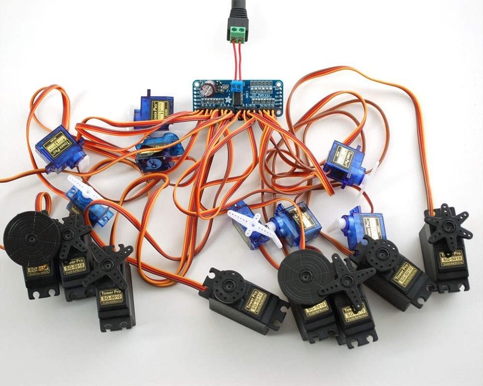
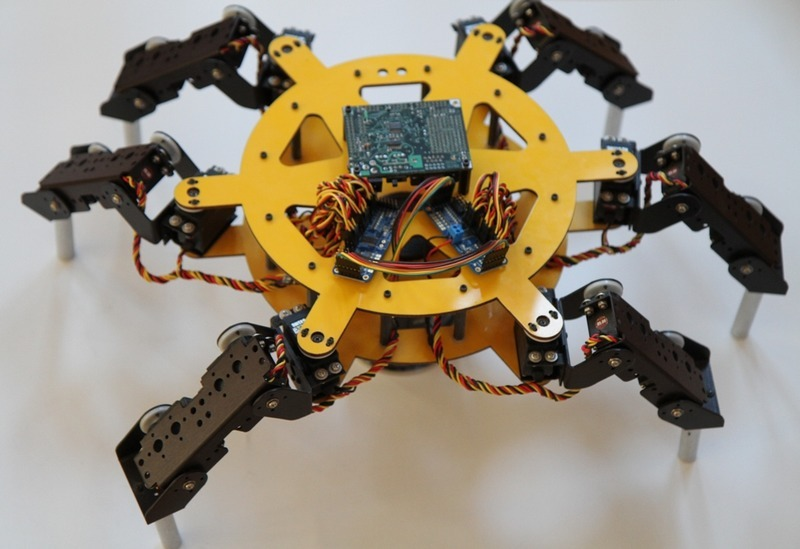
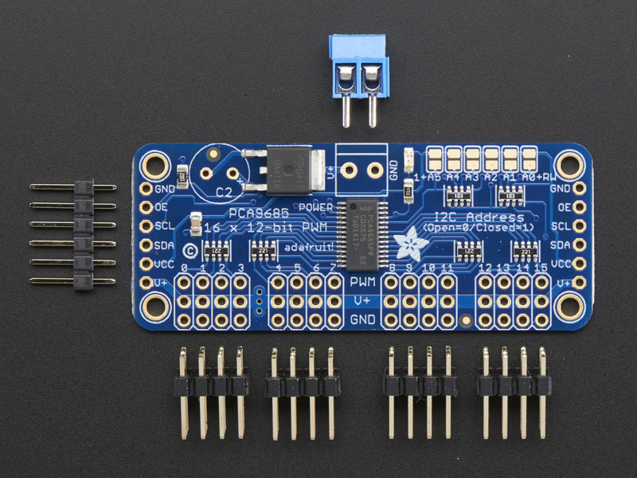
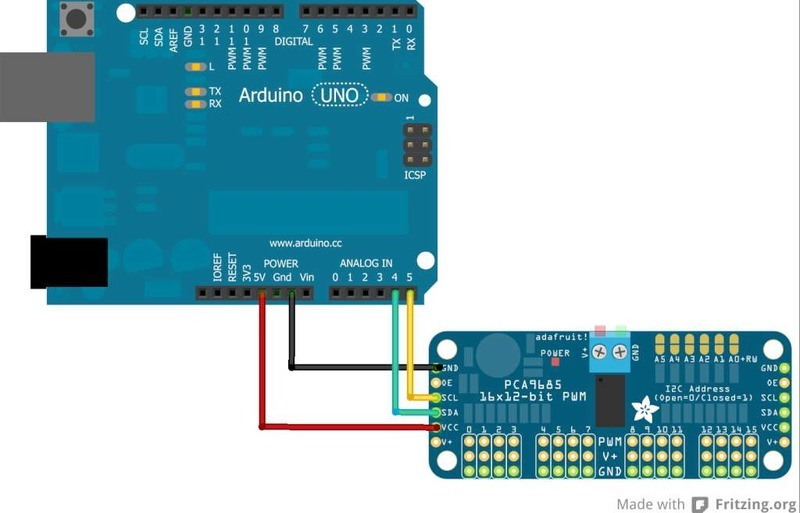
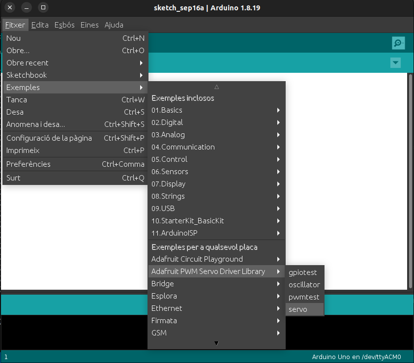

Traducció de Adafruit PCA9685 16-Channel Servo Driver By Bill Earl
<https://learn.adafruit.com/16-channel-pwm-servo-driver/library-reference?view=all>



# Visió general

Controlar servomotors amb la biblioteca Arduino Servo és bastant fàcil,
però cadascun consumeix un pin preciós, per no parlar de la potència de
processament d’Arduino. El controlador PWM/Servo Adafruit de 16 canals
de 12 bits conduirà fins a 16 servos per I2C amb només 2 pins. El
controlador PWM integrat conduirà els 16 canals simultàniament sense cap
sobrecàrrega addicional de processament d’Arduino. A més, podeu
encadenar fins a 62 d’ells per controlar fins a 992 servos, tots amb els
mateixos 2 pins\!

L’Adafruit PWM/Servo Driver és la solució perfecta per a qualsevol
projecte que requereixi molts servos.



# Connexions

Hi ha dos conjunts de pins d’entrada de control a banda i banda. Els dos
costats dels pins són idèntics\! Utilitzeu el costat que vulgueu, també
podeu encadenar fàcilment connectant-ne dos un al costat de l’altre.



## Pins d’alimentació

  - GND: aquest és el pin de terra d’alimentació i senyal, s’ha de
    connectar

  - VCC: aquest és el pin d’alimentació lògica, connecteu-lo al nivell
    lògic que voleu utilitzar per a la sortida PCA9685, hauria de ser
    de 3 a 5V màxim. També s’utilitza per als 10K pullups en SCL/SDA, de
    manera que tret que tingueu els vostres propis pullups, feu que
    coincideixi també amb el nivell lògic del microcontrolador.

  - V+: aquest és un pin d’alimentació opcional que subministrarà
    energia distribuïda als servos. Si no feu servir per a servos, podeu
    deixar-lo desconnectat. El xip no l’utilitza gens. També podeu
    injectar energia des del bloc de terminals de 2 pins a la part
    superior de la placa. Hauríeu de proporcionar 5-6VDC si feu servir
    servos. Si heu de fer-ho, podeu pujar a 12 VDC, però si us enganyeu
    i connecteu VCC a V+, podríeu danyar el vostre tauler\!

## Pins de control

  - SCL - Pin de rellotge I2C, connecteu-lo a la línia de rellotge I2C
    dels vostres microcontroladors. Pot utilitzar la lògica de 3V o 5V i
    té un augment feble de VCC

  - SDA - Pin de dades I2C, connecteu-lo a la línia de dades I2C dels
    vostres microcontroladors. Pot utilitzar la lògica de 3V o 5V i té
    un augment feble de VCC

  - OE - Habilitació de sortida. Es pot utilitzar per desactivar
    ràpidament totes les sortides. Quan aquest pin és baix, tots els
    pins estan habilitats. Quan el pin és alt, les sortides estan
    desactivades. Estat baix per defecte, així que és un pin opcional\!

## Ports de sortida

Hi ha 16 ports de sortida. Cada port té 3 pins: V+, GND i la sortida
PWM. Cada PWM funciona de manera totalment independent, però tots han de
tenir la mateixa freqüència PWM. És a dir, per als LED probablement
voleu 1,0 KHz, però els servos necessiten 60 Hz, de manera que no podeu
utilitzar la meitat per als LED a 1,0 KHz i la meitat a 60 Hz.

Estan configurats per a servos, però els podeu utilitzar per a LED\! El
corrent màxim per pin és de 25 mA.

Hi ha resistències de 220 ohms en sèrie amb tots els pins PWM i la
lògica de sortida és la mateixa que VCC, així que tingueu-ho en compte
si feu servir LED.

# Muntatge

**Instal·leu els connectors de servo**

Instal·leu 4 connectors mascle de 3x4 pins a les posicions marcades al
llarg de la vora del tauler.


**Soldar tots els pins**

N’hi ha molts\!


**Afegiu capçaleres per al control**

S’inclou una tira de capçalera mascle. On voleu instal·lar les
capçaleres i de quin costat depèn una mica de l’ús:

  - Per utilitzar la placa de prova, instal·leu capçaleres a la part
    inferior de la placa.

  - Per utilitzar-lo amb cables de pont, instal·leu les capçaleres a la
    part superior del tauler.

  - Per utilitzar-lo amb el nostre cable de 6 pins, instal·leu les
    capçaleres a la part superior de la placa.

Si esteu encadenant diverses plaques de controladors, voldreu capçaleres
als dos extrems.


**Instal·leu terminals d’alimentació**

Si esteu encadenant diverses plaques de controladors, només necessiteu
un terminal d’alimentació a la primera.


# Connexionat



## Connexió a l’Arduino

El controlador PWM/Servo utilitza I2C, de manera que només calen 4
cables per connectar-se al vostre Arduino:

**Cablejat Arduino "clàssic":**

  - \+5v → VCC (només és alimentació per a la placa de components, NO
    del servo\!)

  - GND → GND

  - Analògic 4 → SDA

  - Analògic 5 → SCL

**Cablejat Mega antic:**

  - \+5v → VCC (només és alimentació per a la placa de components, NO
    del servo\!)

  - GND → GND

  - Digital 20 → SDA

  - Digital 21 → SCL

**Cablejat Arduino R3 i posterior (Uno, Mega i Leonardo):**

(Aquestes plaques tenen pins SDA i SCL dedicats a la capçalera més
propera al connector USB)

  - \+5v → VCC (només és alimentació per a la placa de components, NO
    del servo\!)

  - GND → GND

  - SDA → SDA

  - SCL → SCL

<div class="warning">

El pin VCC és només energia per al propi xip. Si voleu connectar servos
o LED que utilitzen els pins V+, també HEU de connectar el pin V+. El
pin V+ pot arribar a 6 V fins i tot si VCC és de 3,3 V (el xip és segur
de 5 V). Suggerim connectar l’alimentació a través del bloc de terminals
blau, ja que està protegit contra la polaritat.

</div>

# Alimentació per als servos


La majoria dels servos estan dissenyats per funcionar amb uns 5 o 6v.
Tingueu en compte que molts servos que es mouen al mateix temps
(especialment els grans potents) necessitaran molta corrent. Fins i tot
els micro servos dibuixaran diversos centenars de mA quan es mouen.
Alguns servos de par alt consumiran més d'1 A cadascun sota càrrega.

Les bones opcions de poder són:

  - Font d’alimentació commutada 5v 2A

  - Font d’alimentació commutada 5v 10A

  - Suport de piles 4xAA - 6v amb cèl·lules alcalines. 4,8 v amb
    cèl·lules recarregables NiMH.

  - Paquets de bateries RC recarregables de 4,8 o 6 V d’una botiga
    d’aficions.

<div class="warning">

No és una bona idea utilitzar el pin Arduino 5v per alimentar els
vostres servos. El soroll elèctric i els "apagats" de l’excés de consum
de corrent poden fer que el vostre Arduino actuï de manera erràtica, es
reiniciï i/o s’escalfi.

</div>

# Connexió d’un servo


La majoria dels servos vénen amb un connector femella estàndard de 3
pins que es connectarà directament a les capçaleres del
servocontrolador. Assegureu-vos d’alinear l’endoll amb el cable de terra
(normalment negre o marró) amb la fila inferior i el cable de senyal
(generalment groc o blanc) a la part superior.

# Afegeix més servos


Es poden connectar fins a 16 servos a una placa. Si necessiteu controlar
més de 16 servos, es poden encadenar taulers addicionals tal com es
descriu al punt següent.

# Controladors encadenats


Es poden encadenar diversos controladors (fins a 62) per controlar
encara més servos. Amb les capçaleres als dos extrems del tauler, el
cablejat és tan senzill com connectar un cable paral·lel de 6 pins d’un
tauler a l’altre.

# Adreçar les plaques


A cada placa de la cadena se li ha d’assignar una adreça única. Això es
fa amb els ponts d’adreces a la vora superior dreta del tauler. L’adreça
base I2C per a cada placa és 0x40. L’adreça binària que programeu amb
els ponts d’adreça s’afegeix a l’adreça I2C base.

Per programar el desplaçament de l’adreça, utilitzeu una gota de
soldadura per connectar el pont d’adreça corresponent per a cada "1"
binari de l’adreça.

  - Placa 0: Adreça = 0x40 Desplaçament = 00000 binari (no calen ponts)

  - Placa 1: Adreça = 0x41 Desplaçament = binari 00001 (pont A0 com a la
    foto de dalt)

  - Placa 2: Adreça = 0x42 Desplaçament = 00010 binari (pont A1)

  - Placa 3: Adreça = 0x43 Desplaçament = 00011 binari (pont A0 i A1)

  - Placa 4: Adreça = 0x44 Desplaçament = 00100 binari (pont A2)

  - etc.

Al vostre esbós, haureu de declarar un objecte separat per a cada
tauler. Comenceu a cridar a cada objecte i controleu cada servo a través
de l’objecte al qual està connectat. Per exemple:

``` arduino
#include <Wire.h>
#include <Adafruit_PWMServoDriver.h>

Adafruit_PWMServoDriver pwm1 = Adafruit_PWMServoDriver(0x40);
Adafruit_PWMServoDriver pwm2 = Adafruit_PWMServoDriver(0x41);

void setup() {
  Serial.begin(9600);
  Serial.println("16 channel PWM test!");

  pwm1.begin();
  pwm1.setPWMFreq(1600);  // This is the maximum PWM frequency

  pwm2.begin();
  pwm2.setPWMFreq(1600);  // This is the maximum PWM frequency
}
```

# Ús de la biblioteca Adafruit

Com que el Servo Driver PWM es controla mitjançant I2C, és molt fàcil
d’utilitzar amb qualsevol microcontrolador o microordinador. En
aquesta demostració mostrarem com utilitzar-lo amb l’IDE d’Arduino, però
el codi C++ es pot portar fàcilment.

## Instal·leu la biblioteca Adafruit PCA9685

Per començar a llegir les dades del sensor, haureu d’instal·lar la
biblioteca Adafruit\_PWMServo (codi al nostre repositori github). Està
disponible al gestor de biblioteques d’Arduino, per la qual cosa us
recomanem que l’utilitzeu.

Des de l’IDE obriu el gestor de biblioteques…​


I escriviu **adafruit pwm** per localitzar la biblioteca. Feu clic a
**Instal·la**


També tenim un gran tutorial sobre la instal·lació de la biblioteca
Arduino a:
<http://learn.adafruit.com/adafruit-all-about-arduino-libraries-install-use>

## Prova amb el codi d’exemple:

Primer assegureu-vos que totes les còpies de l’IDE d’Arduino estiguin
tancades.

A continuació, obriu l’IDE d’Arduino i seleccioneu
**Fitxer→Examples→Adafruit\_PWMServoDriver→Servo**. Això obrirà el
fitxer d’exemple en una finestra IDE.



Si utilitzeu una placa de components (breakout):

    Connecteu la placa del controlador i el servo com es mostra a la pàgina anterior. No us oblideu de proporcionar energia tant a Vin (nivell lògic de 3-5V) com a V+ (alimentació servo de 5V). Comproveu que el LED verd estigui encès!

Si utilitzeu un escut:

    Connecteu l'escut al vostre Arduino. No oblidis que també hauràs de proporcionar 5V al bloc de terminals V+. Els LED vermells i verds han d'estar encesos.

Si utilitzeu un FeatherWing:

    Connecteu el FeatherWing al vostre Feather. No oblidis que també hauràs de proporcionar 5V al bloc de terminals V+. Comproveu que el LED verd estigui encès!

# Connecteu un servo

S’ha de connectar un únic servo al port PWM \#0, el primer port. Hauríeu
de veure el servo escombrat cap endavant i cap enrere durant
aproximadament 180 graus.

## Calibrant els teus servos

El temps de pols del servo varia entre diferents marques i models. Com
que és un circuit de control analògic, sovint hi ha alguna variació
entre mostres de la mateixa marca i model. Per a un control precís de la
posició, voldreu calibrar l’amplada de pols mínima i màxima del vostre
codi perquè coincideixi amb les posicions conegudes del servo.

**Troba el mínim:**

Utilitzant el codi d’exemple, editeu SERVOMIN fins que el punt baix de
l’escombrat arribi al rang mínim de recorregut. El millor és
acostar-s’hi de manera gradual i aturar-se abans que s’arribi al límit
físic del viatge.

**Troba el màxim:**

De nou, utilitzant el codi d’exemple, editeu SERVOMAX fins que el punt
més alt de l’escombrat arribi al rang màxim de recorregut. De nou, el
millor és apropar-se a això gradualment i aturar-se abans que s’arribi
al límit físic del viatge.

<div class="warning">

Tingueu precaució quan ajusteu SERVOMIN i SERVOMAX. Assolir els límits
físics del viatge pot treure els engranatges i danyar permanentment el
vostre servo.

</div>

# Conversió de graus a longitud de pols

La [funció "map()" d’Arduino](http://arduino.cc/en/Reference/Map)
(<https://adafru.it/aQm>) és una manera senzilla de convertir entre
graus de rotació i les longituds de pols calibrades SERVOMIN i SERVOMAX.
Assumint un servo típic amb 180 graus de rotació; Un cop hàgiu calibrat
SERVOMIN a la posició de 0 graus i SERVOMAX a la posició de 180 graus,
podeu convertir qualsevol angle entre 0 i 180 graus a la longitud de
pols corresponent amb la següent línia de codi:

``` Arduino
pulselength = map(degrees, 0, 180, SERVOMIN, SERVOMAX);
```

# Referència de la biblioteca

## setPWMFreq(freq)

**Descripció**

Aquesta funció es pot utilitzar per ajustar la freqüència PWM, que
determina quants "polsos" complets per segon genera el CI. Dit d’una
altra manera, la freqüència determina la durada de cada pols des del
principi fins al final, tenint en compte tant els segments alts com els
baixos del pols.

La freqüència és important en PWM, ja que establir la freqüència massa
alta amb un cicle de treball molt petit pot causar problemes, ja que el
"temps de pujada" del senyal (el temps que triga a passar de 0V a VCC)
pot ser més llarg que el temps que el senyal està actiu i la sortida PWM
es veurà suavitzada i pot ser que ni tan sols arribi a VCC, la qual cosa
podria causar diversos problemes.

**Arguments**

  - `freq`: un nombre que representa la freqüència en Hz, entre 40 i
    1600

**Exemple**

El codi següent establirà la freqüència PWM a 1000 Hz:

``` Arduino
pwm.setPWMFreq(1000)
```

## setPWM (canal, activat, desactivat)

**Descripció**

Aquesta funció estableix l’inici (activat) i el final (desactivat) del
segment alt del pols PWM en un canal específic. Especifiqueu el valor
"tick" entre 0..4095 quan s’activarà el senyal i quan s’apagarà. El
canal indica quines de les 16 sortides PWM s’han d’actualitzar amb els
nous valors.

**Arguments**

  - `canal`: el canal que s’ha d’actualitzar amb els nous valors (0..15)

  - `on`: La marca (entre 0..4095) quan el senyal hauria de passar de
    baix a alt

  - `off`: la marca (entre 0..4095) quan el senyal hauria de passar
    d’alt a baix

**Exemple**

L’exemple següent farà que el canal 15 comenci a baix, augmenti al
voltant del 25% al pols (marqueu 1024 de 4096), torni al 75% baix al
pols (marqueu 3072) i es mantingui baix durant l’últim 25% de el pols:

``` Arduino
pwm.setPWM(15, 1024, 3072)
```

# Ús com a GPIO

També hi ha alguns paràmetres especials per activar o desactivar
completament els pins

Podeu configurar el pin perquè estigui completament encès

``` Arduino
pwm.setPWM(pin, 4096, 0);
```

Podeu configurar el pin perquè estigui completament apagat

``` Arduino
pwm.setPWM(pin, 0, 4096);
```

# Documentació de la biblioteca Arduino

[Arduino Library
Docs](http://adafruit.github.io/Adafruit-PWM-Servo-Driver-Library/html/class_adafruit___p_w_m_servo_driver.html)
(<https://adafru.it/Au7>)

# Descàrregues

## Fitxers

  - [Full de dades PCA9685
    (anglès)](https://cdn-shop.adafruit.com/datasheets/PCA9685.pdf)

  - [Biblioteca de controladors Arduino
    (anglès)](https://github.com/adafruit/Adafruit-PWM-Servo-Driver-Library)

  - [Fitxers EagleCAD PCB a GitHub
    (anglès)](https://github.com/adafruit/Adafruit-16-Channel-PWM-Servo-Driver-PCB)

  - [Objecte Fritzing a la biblioteca Adafruit
    Fritzing](https://github.com/adafruit/Fritzing-Library)
