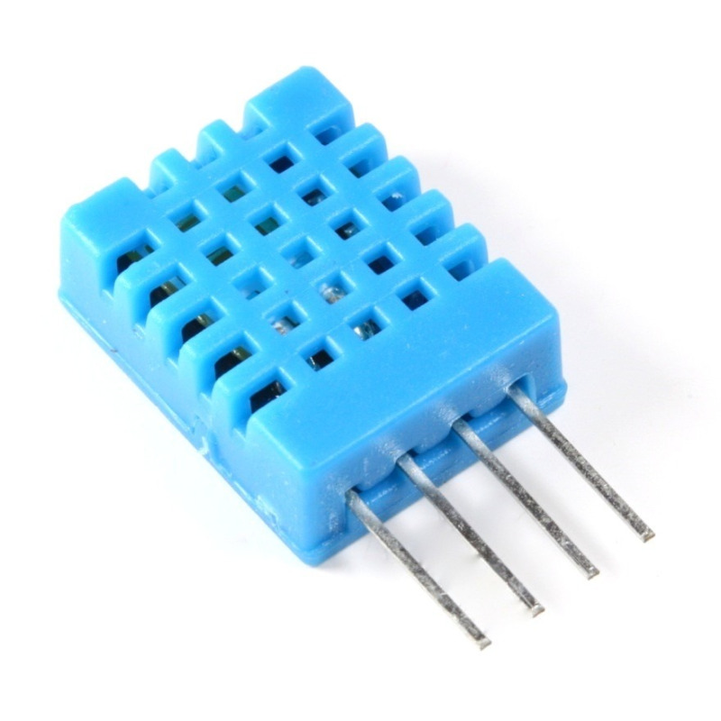

 

# Introducció

La llibreria DHT permet obtindre els valors de temperatura i humitat
dels sensors DHT, les instruccions que utilitzem són fàcils d’entendre i
aplicar en qualsevol projecte amb arduino.

La llibreria que estem treballant està desenvolupada per adafruit, on té
per a descarregar un repositori de github anomenat
[DHT-sensor-library.](https://github.com/adafruit/DHT-sensor-library)

# Funcions

## DHT

### Descripció

Permet crear una instància de la classe DHT on es poden accedir a la
funcionalitat del sensor, rep com a ==== Paràmetres el pin on es
connecte el sensor en el arduino i el tipus de sensor dht amb el qual es
desitja treballar.

### Sintaxi

`DHT dht(DHTPIN, DHTTYPE)`

### Paràmetres

`dht`: identificador de la instància de classe DHT

`DHTPIN`: pin digital on es connecta el sensor

`DHTTYPE`: tipus de sensor connectat

### Retorn

Retorna la instància de la classe DHT

## begin()

### Descripció

Inicialitza la llibreria, el sensor i estableix la configuració per
defecte que puga tindre el dht

### Sintaxi

`dht.begin();`

### Paràmetres

cap

### Retorn

cap

## readHumidity()

### Descripció

Amb aquesta instrucció podem obtindre la humitat relativa de l’ambient,
ens retorna un valor de 0 a 100.

### Sintaxi

`float h dht.readHumidity();`

### Paràmetres

cap

### Retorn

Retorna un valor de 0 a 100 en format punt flotant, indicant el
percentatge d’humitat de l’ambient

## readTemperature()

### Descripció

Retorna la temperatura en rang -40 \~ 80 graus Celsius

### Sintaxi

``` Arduino
//Lee la temperatura en gados celsius
float t  dht.readTemperature();
//Lee la temperatura en grados Fahrenheit (isFahrenheit  true)
float f  dht.readTemperature(true);
```

### Paràmetres

`isFahrenheit`: True per a retornar en graus Fahrenheit, en cas contrari
retorna en graus Celsius

### Retorn

Retorna la temperatura en format punt flotant.

## computeHeatIndex()

### Descripció

Calcular l’índex de calor en Fahrenheit, el qual permet obtindre la
sensació tèrmica que percep el cos humà.

### Sintaxi

``` Arduino
//Obté l’index de calor en Fahrenheit (default)
float hif  dht.computeHeatIndex(f, h);
//Obté l’index de calor en Celsius (isFahreheit  false)
float hic  dht.computeHeatIndex(t, h, false);
```

### Paràmetres

`f, t` : Temperatura en Fahrenheit, Celsius

`h` : Humitat relativa

`isFahrenheit`: True per a retornar en graus Fahrenheit, en cas contrari
retorna en graus Celsius

### Retorn

Retorna la temperatura en format punt flotant.
